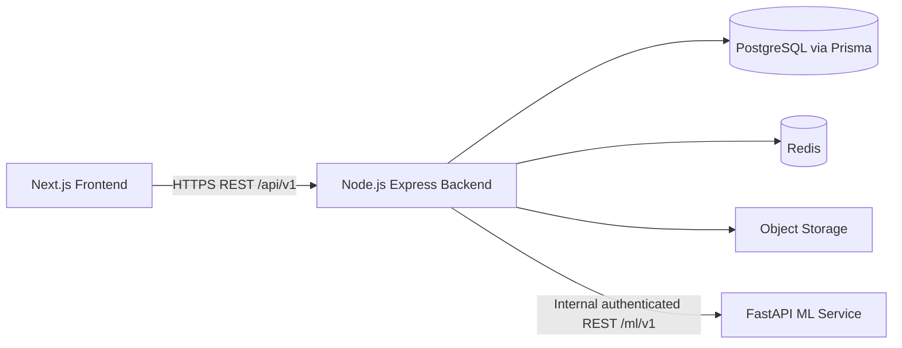

# EduCareer AI 360 API Contract

**Status:** Design contract only. This document does not imply that the endpoints have been implemented.

## 1. API Overview

EduCareer AI 360 exposes versioned REST APIs. The Next.js frontend communicates only with the Node.js/Express backend. The backend owns authorization, validation, persistence, caching, file-storage orchestration, and calls to the internal FastAPI ML service. The frontend never connects directly to PostgreSQL, Redis, object storage, or the ML service.

Resources use plural nouns and UUID identifiers. JSON uses camelCase at the API boundary; Prisma/database snake_case mappings remain internal. Timestamps are ISO 8601 UTC strings.

## 2. Architecture



The backend is the public API gateway. ML responses are normalized by the backend before being returned to clients. Internal ML errors are never exposed with stack traces or secrets.

## 3. Base URLs

| Surface             | Base URL  | Consumer                          |
| ------------------- | --------- | --------------------------------- |
| Public backend      | `/api/v1` | Frontend and approved API clients |
| Internal ML service | `/ml/v1`  | Backend only; never frontend      |

Deployment hosts are environment-specific. All production traffic uses HTTPS. Breaking public changes use `/api/v2`; additive, backward-compatible changes may remain in `/api/v1`.

## 4. Authentication

Protected backend endpoints require `Authorization: Bearer <accessToken>`. The access token is short-lived (target: 15 minutes) and contains the user ID and active role. Refresh tokens are HTTP-only, secure, encrypted cookies (target: 7 days); their exact refresh endpoint is reserved for authentication implementation.

`POST /api/v1/auth/register`, `/login`, `/refresh`, `/logout`, `/verify-email`, `/forgot-password`, and `/reset-password` are public/authentication endpoints. `GET /api/v1/auth/me` requires authentication. SSO remains a future phase. Passwords and token hashes are never returned or logged.

## 5. Authorization/RBAC

Roles are `STUDENT`, `FACULTY`, `TPO`, and `ADMIN`. “Own” means the authenticated user’s linked profile; faculty access is limited to assigned departments/courses; TPO access is institutional placement scope; admin access is system-wide. Every endpoint below lists the minimum role and ownership rule.

| Role    | Scope                                                                                                  |
| ------- | ------------------------------------------------------------------------------------------------------ |
| STUDENT | Own profile, academics, skills, resumes, applications, recommendations, roadmaps, coach, notifications |
| FACULTY | Assigned student/cohort academic data and skill validation; read institutional analytics               |
| TPO     | Placement candidates, companies, jobs, applications, matching, readiness, reports                      |
| ADMIN   | System-wide management, provisioning, configuration, audit logs, and read access                       |

Authorization failures use `403 FORBIDDEN`; a resource outside the caller’s permitted scope may be returned as `404 NOT_FOUND` to avoid disclosure.

## 6. Standard Responses

### Success

```json
{
  "success": true,
  "data": {},
  "message": "Request successful",
  "meta": { "timestamp": "2026-09-12T10:00:00Z" }
}
```

`data` is an object for a single resource and an array for collections. `message` is optional but recommended for mutations. `meta` always includes `timestamp` and includes pagination metadata for paginated lists.

### Error

```json
{
  "success": false,
  "error": {
    "code": "VALIDATION_ERROR",
    "message": "The request is invalid.",
    "details": [{ "field": "email", "issue": "Must be a valid email address." }]
  }
}
```

## 7. Error Handling

| HTTP status | Error code               | Meaning                                     |
| ----------: | ------------------------ | ------------------------------------------- |
|         400 | `BAD_REQUEST`            | Malformed request or unsupported parameter  |
|         401 | `UNAUTHENTICATED`        | Missing, expired, or invalid credentials    |
|         403 | `FORBIDDEN`              | Authenticated but not authorized            |
|         404 | `NOT_FOUND`              | Resource does not exist or is outside scope |
|         409 | `CONFLICT`               | Duplicate or state conflict                 |
|         413 | `PAYLOAD_TOO_LARGE`      | File or request exceeds limit               |
|         415 | `UNSUPPORTED_MEDIA_TYPE` | Unsupported content type                    |
|         422 | `VALIDATION_ERROR`       | Valid JSON but invalid field values         |
|         429 | `RATE_LIMITED`           | Request quota exceeded                      |
|         500 | `INTERNAL_ERROR`         | Unexpected backend failure                  |
|         502 | `UPSTREAM_ERROR`         | ML/storage dependency failure               |
|         503 | `SERVICE_UNAVAILABLE`    | Required dependency unavailable             |

Details must not include SQL, filesystem paths, tokens, passwords, model internals, or stack traces.

## 8. Pagination

Collection endpoints accept `page` and `limit`: `?page=1&limit=20`. Defaults are `page=1`, `limit=20`; maximum `limit=100`. Invalid values produce `422 VALIDATION_ERROR`.

```json
"meta": { "page": 1, "limit": 20, "total": 42, "totalPages": 3, "timestamp": "..." }
```

## 9. Filtering & Sorting

- `search=<text>`: case-insensitive resource search where supported.
- `status=<value>` and resource-specific filters such as `departmentId`, `careerId`, `minGpa`, and `priority`.
- `sort=<field>` and `order=asc|desc`; each resource publishes its allowed fields.
- Comma-separated multi-value filters, such as `skillIds=<uuid>,<uuid>`.
- Unknown filter or sort fields return `422`; server-side allowlists prevent arbitrary query construction.

## 10. Authentication APIs

| Method and endpoint          | Purpose                                         | Authentication/roles   | Parameters, body, validation                                  | Success                                         |
| ---------------------------- | ----------------------------------------------- | ---------------------- | ------------------------------------------------------------- | ----------------------------------------------- |
| `GET /health`                | Public backend liveness check                   | Public                 | None                                                          | `200` `{status:"OK", timestamp}`                |
| `POST /auth/login`           | Authenticate and issue a session                | Public                 | `{email,password}`; valid email and non-empty password        | `200` access token, expiry, user identity/roles |
| `POST /auth/refresh`         | Renew access token                              | Refresh cookie         | Valid, unexpired refresh cookie; no secret in body            | `200` new access token                          |
| `POST /auth/logout`          | Revoke session and clear cookie                 | Any authenticated role | No body                                                       | `204`                                           |
| `GET /auth/me`               | Return current identity                         | Any authenticated role | None                                                          | `200` user identity; never password hash        |
| `POST /auth/register`        | Create a student account and verification token | Public                 | Email, password, first/last name, roll number, admission year | `201` safe user reference                       |
| `POST /auth/verify-email`    | Consume a single-use verification token         | Public                 | `{token}`; token must be unexpired and unused                 | `200`                                           |
| `POST /auth/forgot-password` | Request password reset                          | Public                 | `{email}`; generic response                                   | `202`                                           |
| `POST /auth/reset-password`  | Set a new password                              | Public                 | `{token,password}`; single-use unexpired token                | `200`                                           |

Errors: login uses `401 UNAUTHENTICATED`; invalid bodies use `422`; refresh failure uses `401`.

## 11. Student APIs

| Method and endpoint        | Purpose                         | Authentication/roles                    | Parameters, body, validation                                                | Success                            |
| -------------------------- | ------------------------------- | --------------------------------------- | --------------------------------------------------------------------------- | ---------------------------------- |
| `GET /students/me`         | Read own `Student` profile      | STUDENT; staff through scoped endpoints | None                                                                        | `200` profile, department, GPA     |
| `PATCH /students/me`       | Update permitted profile fields | STUDENT own                             | `firstName`, `lastName`, optional `departmentId`; bounded non-empty strings | `200` updated profile              |
| `GET /students/:studentId` | Read a student profile          | FACULTY/TPO/ADMIN scoped; STUDENT self  | UUID path parameter                                                         | `200` profile; `404` outside scope |
| `GET /students`            | Search student directory        | FACULTY/TPO/ADMIN                       | Pagination; `search`, `departmentId`, `admissionYear`, sorting              | `200` paginated profiles           |

## 12. Academic APIs

| Method and endpoint                         | Purpose                | Authentication/roles                   | Parameters, body, validation                                                            | Success       |
| ------------------------------------------- | ---------------------- | -------------------------------------- | --------------------------------------------------------------------------------------- | ------------- |
| `GET /students/me/academic-records`         | List own grade records | STUDENT                                | Pagination; `semesterId`, sorting                                                       | `200` records |
| `GET /students/:studentId/academic-records` | Read student grades    | STUDENT self, FACULTY/TPO/ADMIN scoped | UUID; pagination and `semesterId`                                                       | `200` records |
| `POST /academic-records`                    | Create/import a grade  | FACULTY/ADMIN                          | `studentId`, `subjectId`, `semesterId`, `gradePoints` 0–10, `letterGrade`; unique tuple | `201` record  |
| `PATCH /academic-records/:recordId`         | Correct a grade        | FACULTY/ADMIN scoped                   | UUID; same range rules                                                                  | `200` record  |

## 13. Skills APIs

| Method and endpoint                         | Purpose            | Authentication/roles                     | Parameters, body, validation               | Success              |
| ------------------------------------------- | ------------------ | ---------------------------------------- | ------------------------------------------ | -------------------- | -------- | ----------------------------- | ------------------- |
| `GET /skills`                               | Browse taxonomy    | Any authenticated role                   | Pagination; `search`, `category`, sorting  | `200` skills         |
| `GET /skills/:skillId`                      | Read a skill       | Any authenticated role                   | UUID                                       | `200` skill          |
| `GET /students/me/skills`                   | Read own inventory | STUDENT; authorized staff scoped         | Pagination; `verified`, `proficiencyLevel` | `200` student skills |
| `POST /students/me/skills`                  | Add own skill      | STUDENT                                  | `skillId`; proficiency `BEGINNER           | INTERMEDIATE         | ADVANCED | EXPERT`; unique student/skill | `201` student skill |
| `PATCH /students/me/skills/:studentSkillId` | Update proficiency | STUDENT self; staff only where permitted | UUID; allowed proficiency values           | `200` student skill  |

## 14. Career APIs

| Method and endpoint        | Purpose                  | Authentication/roles   | Parameters, body, validation                                             | Success                          |
| -------------------------- | ------------------------ | ---------------------- | ------------------------------------------------------------------------ | -------------------------------- |
| `GET /careers`             | List career taxonomy     | Any authenticated role | Pagination; `search`, sorting                                            | `200` careers                    |
| `GET /careers/:careerId`   | Read career requirements | Any authenticated role | UUID                                                                     | `200` career and required skills |
| `POST /careers`            | Create taxonomy entry    | ADMIN                  | Unique non-empty `title`, optional description, `minGpaRequirement` 0–10 | `201` career                     |
| `PATCH /careers/:careerId` | Update career metadata   | ADMIN                  | UUID; same rules                                                         | `200` career                     |

## 15. Recommendation APIs

| Method and endpoint                               | Purpose                      | Authentication/roles                   | Parameters, body, validation                                                           | Success                           |
| ------------------------------------------------- | ---------------------------- | -------------------------------------- | -------------------------------------------------------------------------------------- | --------------------------------- | --------------------- |
| `POST /career-recommendations`                    | Request recommendations      | STUDENT self, FACULTY advisor, ADMIN   | Optional scoped `studentId`; optional bounded `interests`; profile data server-derived | `202` job/status or `200` results |
| `GET /students/me/career-recommendations`         | Read cached recommendations  | STUDENT; staff scoped                  | Pagination; `sort=matchPercentage                                                      | createdAt`, `order`               | `200` recommendations |
| `GET /students/:studentId/career-recommendations` | Read student recommendations | FACULTY/TPO/ADMIN scoped; STUDENT self | UUID and pagination                                                                    | `200` recommendations             |

Items contain `careerId`, `careerTitle`, `matchPercentage` 0–100, `rationale`, and `createdAt`.

## 16. Skill Gap APIs

| Method and endpoint                   | Purpose                   | Authentication/roles                 | Parameters, body, validation                                              | Success    |
| ------------------------------------- | ------------------------- | ------------------------------------ | ------------------------------------------------------------------------- | ---------- |
| `POST /skill-gaps/analyze`            | Analyze gaps for a career | STUDENT self, FACULTY advisor, ADMIN | `targetCareerId` UUID; optional scoped `studentId`; skills server-derived | `200` gaps |
| `GET /students/me/skill-gaps`         | Read latest gaps          | STUDENT; FACULTY/TPO/ADMIN scoped    | Pagination; `priority`, `careerId`, sorting                               | `200` gaps |
| `GET /students/:studentId/skill-gaps` | Read student gaps         | STUDENT self or authorized staff     | UUID, pagination/filtering                                                | `200` gaps |

Priority is `HIGH|MEDIUM|LOW`. Clients cannot submit arbitrary student inventories for persisted analysis.

## 17. Roadmap APIs

| Method and endpoint                        | Purpose                   | Authentication/roles                        | Parameters, body, validation                                  | Success                         |
| ------------------------------------------ | ------------------------- | ------------------------------------------- | ------------------------------------------------------------- | ------------------------------- | ------------------------ | ---------- |
| `POST /roadmaps`                           | Create/regenerate roadmap | STUDENT self, FACULTY advisor, ADMIN        | `targetCareer` or `targetCareerId`; optional bounded timeline | `201` or `202` roadmap          |
| `GET /students/me/roadmap`                 | Read own roadmap          | STUDENT; staff scoped                       | None                                                          | `200` roadmap and ordered items |
| `GET /students/:studentId/roadmap`         | Read student roadmap      | STUDENT self or authorized staff            | UUID                                                          | `200` roadmap                   |
| `PATCH /roadmaps/:roadmapId/items/:itemId` | Update milestone          | STUDENT self; FACULTY/ADMIN where permitted | Status `COMPLETED                                             | CURRENT                         | LOCKED`; ownership check | `200` item |

Roadmap order is server-controlled. Invalid transitions return `409 CONFLICT`.

## 18. Placement APIs

| Method and endpoint                            | Purpose                  | Authentication/roles                       | Parameters, body, validation                                               | Success                                |
| ---------------------------------------------- | ------------------------ | ------------------------------------------ | -------------------------------------------------------------------------- | -------------------------------------- |
| `GET /students/me/placement-readiness`         | Read own readiness       | STUDENT; TPO/ADMIN scoped                  | None                                                                       | `200` score, label, drivers, timestamp |
| `GET /students/:studentId/placement-readiness` | Read readiness           | STUDENT self, TPO/ADMIN; FACULTY by policy | UUID                                                                       | `200` readiness                        |
| `POST /placement-readiness/predict`            | Request recalculation    | STUDENT self, TPO/ADMIN                    | Optional scoped `studentId`; features server-derived or bounded 0–10/0–100 | `202` or `200` prediction              |
| `GET /placement-readiness`                     | Read readiness directory | TPO/ADMIN                                  | Pagination; `statusLabel`, score range, `departmentId`, sorting            | `200` results                          |

## 19. Resume APIs

| Method and endpoint               | Purpose               | Authentication/roles            | Parameters, body, validation                                                                    | Success                                              |
| --------------------------------- | --------------------- | ------------------------------- | ----------------------------------------------------------------------------------------------- | ---------------------------------------------------- |
| `POST /resumes`                   | Upload resume         | STUDENT self                    | `multipart/form-data`, `file`; PDF or DOCX; max 5 MiB; content/signature and malware validation | `201` metadata, `resumeId`, status, size, media type |
| `GET /resumes`                    | List resume metadata  | STUDENT own, TPO/ADMIN scoped   | Pagination; `studentId`, sorting                                                                | `200` metadata; no storage credentials               |
| `GET /resumes/:resumeId`          | Read metadata         | Owner/TPO/ADMIN scoped          | UUID                                                                                            | `200` metadata                                       |
| `DELETE /resumes/:resumeId`       | Request deletion      | STUDENT owner, ADMIN            | UUID; retention policy applies                                                                  | `204`                                                |
| `POST /resumes/:resumeId/analyze` | Start/repeat analysis | STUDENT owner, TPO/ADMIN scoped | UUID; scanned resume required                                                                   | `202` analysis status                                |

Errors: `413` over 5 MiB, `415` non-PDF, `422` invalid multipart, `400` signature/scan failure. Files use UUID/hash storage keys and backend-controlled short-lived retrieval URLs.

## 20. Resume Analysis APIs

| Method and endpoint               | Purpose              | Authentication/roles            | Parameters, body, validation                  | Success                           |
| --------------------------------- | -------------------- | ------------------------------- | --------------------------------------------- | --------------------------------- |
| `GET /resumes/:resumeId/analysis` | Read latest analysis | Student owner, TPO/ADMIN scoped | UUID                                          | `200` analysis or `404` not ready |
| `GET /resume-analyses`            | Search analyses      | TPO/ADMIN; student own only     | Pagination; `studentId`, score range, sorting | `200` analyses                    |

Analysis contains `overallScore` 0–100, `grammarFeedback`, `extractedSkills`, and `recommendations`. Status is `PENDING|PROCESSING|COMPLETED|FAILED`.

## 21. Company APIs

| Method and endpoint           | Purpose          | Authentication/roles | Parameters, body, validation                       | Success         |
| ----------------------------- | ---------------- | -------------------- | -------------------------------------------------- | --------------- |
| `GET /companies`              | Browse companies | TPO/ADMIN            | Pagination; `search`, `industry`, sorting          | `200` companies |
| `GET /companies/:companyId`   | Read company     | TPO/ADMIN            | UUID                                               | `200` company   |
| `POST /companies`             | Create company   | TPO/ADMIN            | Unique `name`; optional valid website and industry | `201` company   |
| `PATCH /companies/:companyId` | Update company   | TPO/ADMIN            | UUID; same validation                              | `200` company   |

## 22. Job APIs

| Method and endpoint   | Purpose      | Authentication/roles | Parameters, body, validation                                               | Success                       |
| --------------------- | ------------ | -------------------- | -------------------------------------------------------------------------- | ----------------------------- |
| `GET /jobs`           | Browse jobs  | Authenticated roles  | Pagination; `companyId`, `minGpa`, `skillIds`, `search`, deadline, sorting | `200` jobs                    |
| `GET /jobs/:jobId`    | Read job     | Authenticated roles  | UUID                                                                       | `200` job and required skills |
| `POST /jobs`          | Publish job  | TPO/ADMIN            | Company, title, description, GPA 0–10, future deadline, skill IDs          | `201` job                     |
| `PATCH /jobs/:jobId`  | Update job   | TPO/ADMIN scoped     | UUID; same GPA/deadline rules                                              | `200` job                     |
| `DELETE /jobs/:jobId` | Withdraw job | TPO/ADMIN            | UUID; application retention applies                                        | `204`                         |

## 23. Application APIs

| Method and endpoint                         | Purpose                   | Authentication/roles                    | Parameters, body, validation                                | Success            |
| ------------------------------------------- | ------------------------- | --------------------------------------- | ----------------------------------------------------------- | ------------------ | ------------ | ------- | --------------------------- | ----------------- |
| `POST /jobs/:jobId/apply`                   | Submit application        | STUDENT                                 | UUID; job open, before deadline, GPA eligible, no duplicate | `201` application  |
| `GET /applications`                         | List applications         | STUDENT own; TPO/ADMIN institution-wide | Pagination; `studentId`, `jobId`, `status`, sorting         | `200` applications |
| `GET /applications/:applicationId`          | Read application          | Owner/TPO/ADMIN                         | UUID                                                        | `200` application  |
| `PATCH /applications/:applicationId/status` | Update recruitment status | TPO/ADMIN                               | `SUBMITTED                                                  | SHORTLISTED        | INTERVIEWING | OFFERED | REJECTED`; valid transition | `200` application |

## 24. Simulator APIs

| Method and endpoint      | Purpose                                           | Authentication/roles | Parameters, body, validation                                                                               | Success                                             |
| ------------------------ | ------------------------------------------------- | -------------------- | ---------------------------------------------------------------------------------------------------------- | --------------------------------------------------- |
| `POST /simulator/career` | Evaluate hypothetical changes without persistence | STUDENT self         | `targetCareerId`, `simulatedSkillIds[]`, `simulatedGpa` 0–10; bounded list; current profile server-derived | `200` original/simulated percentages and difference |

Simulation never modifies skills, recommendations, readiness, or roadmaps.

## 25. AI Coach APIs

| Method and endpoint                           | Purpose                           | Authentication/roles                       | Parameters, body, validation                                 | Success                                |
| --------------------------------------------- | --------------------------------- | ------------------------------------------ | ------------------------------------------------------------ | -------------------------------------- |
| `POST /ai-coach/conversations`                | Create conversation               | STUDENT self                               | Optional bounded title                                       | `201` conversation metadata            |
| `POST /ai-coach/messages`                     | Send message and receive coaching | STUDENT self                               | `conversationId` UUID, `text` 1–4,000 chars; ownership check | `201` message/response or `202` status |
| `GET /ai-coach/conversations`                 | List conversations                | STUDENT; ADMIN audited support scope       | Pagination; sorting                                          | `200` conversations                    |
| `GET /ai-coach/conversations/:conversationId` | Read conversation/messages        | STUDENT owner; ADMIN audited support scope | UUID; message pagination                                     | `200` conversation                     |

The backend supplies minimum-necessary context: target career, aggregate academic indicators, verified skills, and relevant roadmap data. It excludes password hashes, tokens, private file contents, unrelated students, and full audit records. Client-supplied context is not trusted. Streaming, if introduced, remains behind the backend.

## 26. Notification APIs

| Method and endpoint                        | Purpose                | Authentication/roles   | Parameters, body, validation  | Success             |
| ------------------------------------------ | ---------------------- | ---------------------- | ----------------------------- | ------------------- |
| `GET /notifications`                       | List own notifications | Any authenticated role | Pagination; `isRead`, sorting | `200` notifications |
| `PATCH /notifications/:notificationId`     | Mark read/unread       | Owner                  | UUID; `{isRead:boolean}`      | `200` notification  |
| `POST /notifications/:notificationId/read` | Idempotently mark read | Owner                  | UUID                          | `200` notification  |

## 27. Faculty APIs

| Method and endpoint                                   | Purpose                      | Authentication/roles         | Parameters, body, validation                                       | Success                      |
| ----------------------------------------------------- | ---------------------------- | ---------------------------- | ------------------------------------------------------------------ | ---------------------------- |
| `GET /faculty/me`                                     | Read faculty profile         | FACULTY/ADMIN                | None                                                               | `200` profile                |
| `GET /faculty/cohorts`                                | List assigned cohorts        | FACULTY/ADMIN                | Pagination; department/semester filters, sorting                   | `200` cohorts                |
| `GET /faculty/students/at-risk`                       | Read intervention candidates | FACULTY assigned scope/ADMIN | Pagination; `riskLevel`, department, sorting                       | `200` aggregate risk records |
| `POST /faculty/students/:studentId/skill-assessments` | Validate skill               | FACULTY assigned scope/ADMIN | UUID; `studentSkillId`, type, optional score 0–100/certificate URL | `201` assessment             |
| `GET /faculty/analytics`                              | Read academic aggregates     | FACULTY assigned scope/ADMIN | Semester and department filters                                    | `200` analytics              |

## 28. TPO APIs

| Method and endpoint                             | Purpose                    | Authentication/roles | Parameters, body, validation                              | Success                   |
| ----------------------------------------------- | -------------------------- | -------------------- | --------------------------------------------------------- | ------------------------- |
| `GET /tpo/me`                                   | Read TPO profile           | TPO/ADMIN            | None                                                      | `200` profile             |
| `GET /tpo/metrics`                              | Read placement metrics     | TPO/ADMIN            | Department and date/semester filters                      | `200` metrics             |
| `GET /tpo/candidates`                           | Filter candidates          | TPO/ADMIN            | Pagination; GPA/readiness ranges, skills, search, sorting | `200` candidate summaries |
| `GET /tpo/jobs/:jobId/matches`                  | Read ranked candidates     | TPO/ADMIN            | UUID; pagination, score/ineligible filters                | `200` matches             |
| `PATCH /tpo/applications/:applicationId/status` | Review application         | TPO/ADMIN            | UUID; allowed status                                      | `200` application         |
| `GET /tpo/reports/placement`                    | Read placement report data | TPO/ADMIN            | Date, department, semester filters                        | `200` report data         |

## 29. Admin APIs

| Method and endpoint                  | Purpose                  | Authentication/roles | Parameters, body, validation                                                     | Success                             |
| ------------------------------------ | ------------------------ | -------------------- | -------------------------------------------------------------------------------- | ----------------------------------- |
| `POST /admin/users/provision`        | Provision from CSV/JSON  | ADMIN                | CSV max 20 MiB; validate content/signature; required email and allowlisted roles | `202` import status                 |
| `GET /admin/users/imports/:importId` | Read provisioning status | ADMIN                | UUID                                                                             | `200` status and sanitized errors   |
| `GET /admin/users`                   | Search/manage users      | ADMIN                | Pagination; search/status/role/sorting                                           | `200` users without password hashes |
| `PATCH /admin/users/:userId/roles`   | Assign/revoke roles      | ADMIN                | UUID; non-empty allowlisted role set; audited                                    | `200` roles                         |
| `GET /admin/system/health`           | Read dependency health   | ADMIN                | None                                                                             | `200` sanitized statuses            |

## 30. Reporting APIs

| Method and endpoint               | Purpose            | Authentication/roles              | Parameters, body, validation    | Success                  |
| --------------------------------- | ------------------ | --------------------------------- | ------------------------------- | ------------------------ | ---------------- |
| `POST /reports`                   | Generate report    | TPO/ADMIN; FACULTY assigned scope | Type, filters, `format=CSV      | PDF`; allowlisted fields | `202` report job |
| `GET /reports`                    | List reports       | TPO/ADMIN; FACULTY own/scope      | Pagination; type/format/sorting | `200` reports            |
| `GET /reports/:reportId`          | Read report status | Authorized scope                  | UUID                            | `200` metadata           |
| `GET /reports/:reportId/download` | Download report    | Authorized scope                  | UUID; signed backend stream     | `200` file               |

## 31. Audit APIs

| Method and endpoint                 | Purpose                 | Authentication/roles | Parameters, body, validation                                | Success              |
| ----------------------------------- | ----------------------- | -------------------- | ----------------------------------------------------------- | -------------------- |
| `GET /admin/audit-logs`             | Search immutable events | ADMIN                | Pagination; actor/action/table/record/date filters, sorting | `200` sanitized logs |
| `GET /admin/audit-logs/:auditLogId` | Read one event          | ADMIN                | UUID                                                        | `200` event          |

Audit records include actor, action, resource/table, record ID, redacted old/new values, IP metadata, and timestamp. Clients cannot create, update, or delete audit logs.

## 32. ML Service Contract

These are internal backend-to-FastAPI contracts. They use `/ml/v1` and an internal service credential in `Authorization`. The frontend must never call them. The current scaffold defines the schemas below; production model identifiers and confidence fields are reserved and must be added compatibly when models are introduced.

Common errors: `401` missing authorization, `403` invalid credentials, `422` validation failure, `500` service/model failure, and `503` unavailable dependency. Never expose model files, prompts, credentials, or stack traces.

### `POST /ml/v1/performance/predict`

- Request: `historical_gpa` 0–10; `quiz_average` 0–100; `assignment_submission_rate` 0–1; `attendance_percentage` 0–1; `course_credits` integer >0.
- Response: `{predicted_gpa:number, risk_level:string, prediction_interval:{lower:number,upper:number}}`.
- Prediction: GPA/risk estimate and interval. Current scaffold returns a foundation result.
- Model identifier/confidence: reserved and currently omitted.

### `POST /ml/v1/career/recommend`

- Request: `{verified_skills:string[], interests:string[], academic_gpa:number}`; GPA 0–10.
- Response: `{recommendations:[{career_title:string, match_percentage:number, rationale:string}]}`.
- Prediction: ranked career recommendations. Model identifier and confidence are reserved and omitted by the scaffold.

### `POST /ml/v1/skill-gap/analyze`

- Request: `{student_skills:string[], target_career_id:string}`.
- Response: `{gaps:[{skill_name:string, priority:string}]}`.
- Prediction: missing skills and priorities. Backend validates/normalizes priority before persistence; model identifier/confidence are reserved.

### `POST /ml/v1/readiness/predict`

- Request: `gpa` 0–10; `verified_skills_count` integer >=0; `mock_interview_score` 0–100; `resume_score` 0–100; `completed_internships` integer >=0.
- Response: `{readiness_score:number, status_label:string, drivers:string[]}`; score 0–100.
- Prediction: readiness score, label, and drivers. Model identifier/confidence are reserved and omitted.

### `POST /ml/v1/jobs/match`

- Request: `{student_skills:string[], gpa:number, jobs:[{job_id:string,required_skills:string[],min_gpa:number}]}`; GPA values 0–10.
- Response: `{matches:[{job_id:string,match_score:number,ineligible:boolean}]}`; score 0–100.
- Prediction: job compatibility and eligibility. Model identifier/confidence are reserved and omitted.

### `POST /ml/v1/simulator/predict`

- Request: `{current_profile:{gpa:number,skills:string[]},simulated_skills:string[],simulated_gpa:number,target_career_id:string}`; GPAs 0–10.
- Response: `{original_match_percentage:number,simulated_match_percentage:number,improved_score_difference:number}`; percentages 0–100.
- Prediction: non-persistent hypothetical comparison. Model identifier/confidence are reserved and omitted.

The current service also exposes `GET /ml/v1/health`, an unauthenticated liveness endpoint returning status, timestamp, and service name. The backend may use it for dependency health checks.

## 33. Security Considerations

### Security

- **Authentication:** JWT access tokens and secure HTTP-only refresh cookies; validate expiry, issuer, audience, and signature.
- **Authorization:** RBAC plus ownership, department, and institution checks before data access.
- **Rate limiting:** target 5 attempts/minute/IP for login, 10 requests/minute/IP for coach and resume ingestion, and 100 requests/minute/IP for standard endpoints. Apply authenticated user quotas too.
- **Input validation:** strict schemas, UUIDs, bounded strings/arrays, numeric ranges, enums, content types, and allowlisted sort/filter fields.
- **Uploads:** resumes PDF/max 5 MiB; rosters CSV/max 20 MiB; magic-byte verification, malware scan, sanitized UUID storage key, and signed short-lived retrieval.
- **CORS:** configured frontend origins only; no wildcard origin with credentials.
- **Sensitive data:** never return password hashes, tokens, secrets, raw authorization headers, private storage paths, unnecessary student data, or unredacted audit payloads. Redact logs.
- **Transport and headers:** HTTPS in deployed environments, Helmet/security headers, request IDs, structured audit logs, and generic production errors.
- **Upstream isolation:** ML credentials are backend-only. Use timeouts, bounded payloads, limited retries, and circuit breaking.
- **Idempotency:** queued generation/report mutations should accept an idempotency key; duplicate applications and role operations must be safe.

## 34. API Versioning

All public paths use `/api/v1`; internal ML paths use `/ml/v1`. Additive changes remain backward compatible. Breaking changes to required fields, semantics, authorization, or response shape require `/api/v2`, updated documentation, and a deprecation plan. No unversioned public API paths are permitted.
