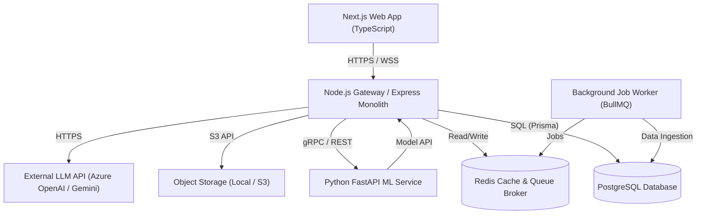
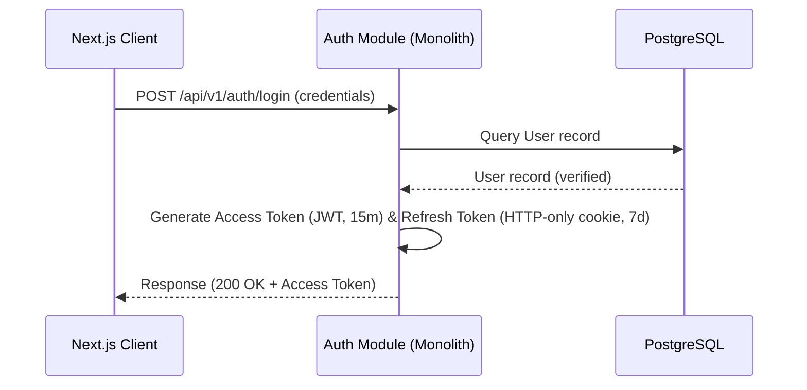
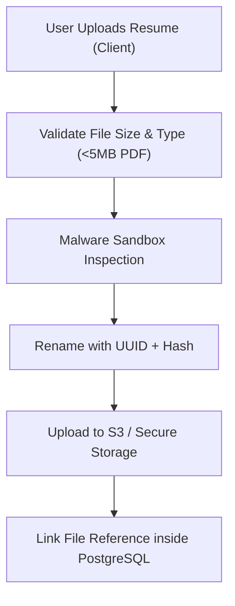
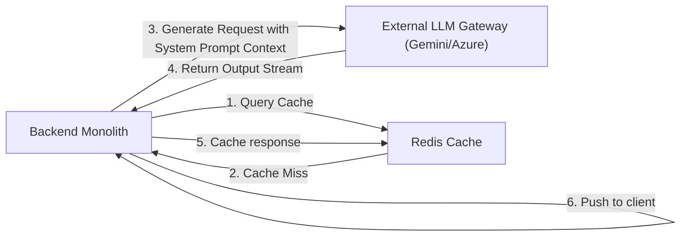
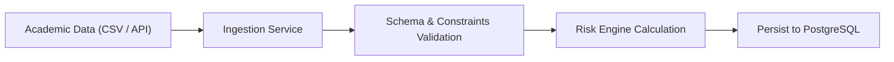
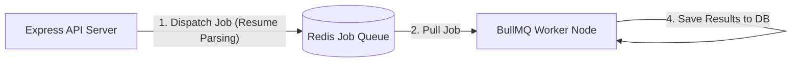
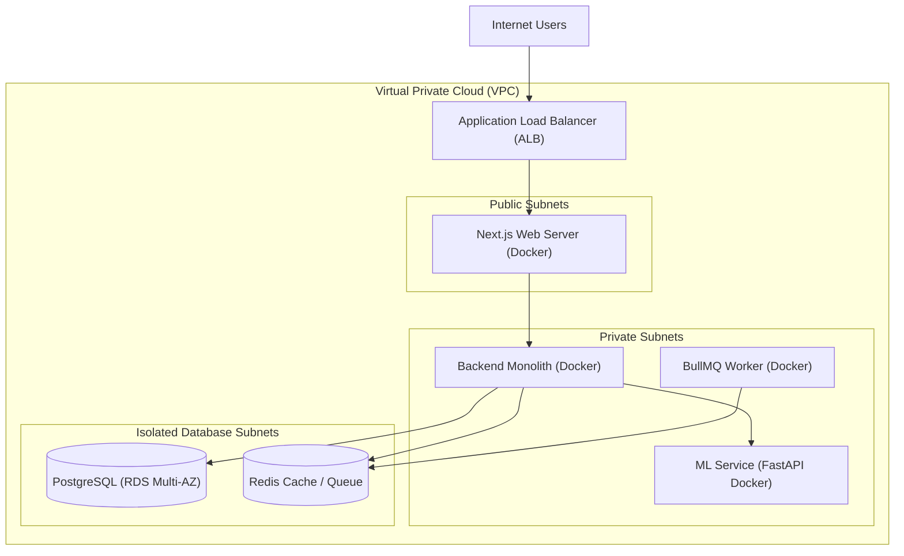

# Technical Architecture Specification - EduCareer AI 360

This document defines the software, data, machine learning, and deployment architecture for the EduCareer AI 360 platform. It outlines a modular monolith approach for the core backend, paired with an independently deployable Python ML service, ensuring high scalability, modular boundaries, and a clean migration path to microservices in the future.

---

## 1. Overall System Architecture

EduCareer AI 360 uses a decoupled, three-tier architecture comprising:

1. **Frontend**: Next.js (TypeScript) single-page application and server-side rendering client.
2. **Main Core Backend**: A Modular Monolith built with Node.js, Express, and TypeScript.
3. **ML Service**: An independent Python FastAPI service executing heavy analytical modeling and data processing.
4. **Data & Storage Layer**: PostgreSQL as the relational transactional database, Redis as the cache/job-queue broker, and local/S3 object storage for static documents.

### System Boundary Diagram



### Communication Protocols

- **Client to Monolith**: HTTPS for REST APIs; WSS (WebSockets) for streaming AI Career Coach chat responses.
- **Monolith to ML Service**: REST API over loopback/internal network. Designed to easily shift to gRPC when scaling.
- **Monolith to DB/Cache**: Database TCP connections managed by Prisma ORM pool; Redis protocol for caching and background queues.
- **Monolith to External LLM**: Secure HTTPS client utilizing official SDKs with API keys managed via environment secrets.

---

## 2. Frontend Architecture

The frontend is built with **Next.js (App Router)** and **TypeScript** to achieve rapid server-side rendering (SSR), search engine optimization (SEO) where needed, and a component structure that implements the aesthetic details of `docs/DESIGN.md`.

```
src/
├─ app/                 # Next.js pages, routing & layouts
├─ components/
│  ├─ ui/                # Reusable design system atoms (Button, Badge, Card, etc.)
│  └─ dashboard/        # Complex dashboard containers and charts
├─ hooks/                # Custom React hooks (useResponsive, useAuth)
├─ services/             # API client calls & WebSocket controllers
└─ store/               # Frontend state management (Zustand)
```

### Rationale

- **Next.js App Router**: Provides seamless file-system routing, built-in layout sharing, and hybrid rendering strategies (Server vs. Client components) to optimize initial page load times.
- **Zustand for State**: A lightweight, minimal boilerplate alternative to Redux for global client-side states (e.g., chat histories, active simulation variables, user identity).
- **Tailwind CSS**: Allows rapid composition of high-fidelity components matching the color tokens, spacing scale, and glassmorphism specifications.
- **Recharts**: Simple, react-native SVG charting engine matching the design system's thin-line and flat-shading data visualization constraints.

---

## 3. Backend Architecture (Modular Monolith)

The backend is structured as a **Modular Monolith** using **Node.js, Express, and TypeScript**. Code is organized by domain rather than layer to prevent spaghetti dependencies and enable easy extraction into microservices later.

```
src/
├─ modules/
│  ├─ auth/             # Authentication & session token management
│  ├─ academic/         # Student performance metrics & course data
│  ├─ resume/           # Resume parsing triggers & scores
│  ├─ careers/          # Career recommendations & roadmaps
│  ├─ jobs/             # Job postings, applications & tracking
│  └─ notifications/    # In-app alerts & email dispatchers
├─ shared/
│  ├─ middleware/       # RBAC check, error interceptor, logger
│  ├─ database/         # Prisma client instance setup
│  └─ services/         # Storage interface, general utilities
└─ server.ts            # Entrypoint
```

### Rationale

- **Domain-Driven Modularization**: Each domain is self-contained. Communication across domains is strictly limited to importing public interfaces or using an event broker, preventing database cross-joins.
- **TypeScript**: Establishes strong type safety at boundary APIs, matching the database schemas exactly.
- **Express**: A lightweight, unopinionated routing engine offering low latency and easy middleware chaining.

---

## 4. ML Service Architecture

The Machine Learning engine is an independent **Python service** built on **FastAPI** to execute model scoring, data vectorization, and statistical matching algorithms.

```
ml_service/
├─ models/              # Serialized artifacts (.pkl, .bin files)
├─ pipelines/           # Data preprocessing and vectorization pipelines
├─ src/
│  ├─ api/              # FastAPI endpoints
│  ├─ algorithms/       # Placement-readiness scoring, career compatibility similarity
│  └─ utils/            # Document parsing adapters (pdfminer, docx2txt)
├─ requirements.txt
└─ main.py
```

### Rationale

- **FastAPI**: Exceptionally fast Python web framework leveraging ASGI servers (Uvicorn), featuring automatic OpenAPI documentation and native asynchronous support.
- **Data Science Stack**: Scikit-learn and XGBoost for classification (placement-readiness); Pandas and NumPy for tabular grading projections and matrix manipulations.
- **Separate Lifecycle**: Decoupling allows scaling the ML compute resources independently of the web backend, which is critical due to memory-intensive Python processes.

---

## 5. Database Architecture

The data tier utilizes **PostgreSQL** due to its mature support for relational data structures, transactions, and robust indexing.

```mermaid
erDiagram
    User ||--o1 StudentProfile : "has"
    User ||--o1 FacultyProfile : "has"
    User ||--o1 TpoProfile : "has"
    StudentProfile ||--o{ GradeRecord : "earns"
    StudentProfile ||--o{ CareerRoadmap : "follows"
    StudentProfile ||--o{ JobApplication : "submits"
    JobDrive ||--o{ JobApplication : "receives"
    StudentProfile ||--o{ SkillInventory : "possesses"
```

### Key Entities & Relations

- **User**: Base identity schema (email, hashedPassword, role, status).
- **StudentProfile**: GPA, bio, targeted careers, placement readiness metrics.
- **GradeRecord**: Course code, marks, semester index, attendance rate.
- **JobDrive**: Employer information, job description, required GPA, application deadlines.
- **JobApplication**: Link table between student and job drive tracking recruitment stage.
- **Prisma Integration**: Database schemas are managed via `schema.prisma`. Migrations are tracked sequentially under source control, and client classes are auto-generated on server bootstrap.

---

## 6. Authentication Architecture

Authentication v1 uses email/password with short-lived **JSON Web Tokens (JWT)** and revocable HTTP-only refresh sessions. SSO/OIDC remains a future phase.



### Key Controls

- **Access Tokens**: Short-lived, containing only required identity and role claims, stored in memory by the frontend integration.
- **Refresh Tokens**: Long-lived, secure `HttpOnly`, `SameSite=Strict` cookie values with only a SHA-256 token hash stored server-side; v1 rotation is disabled and expiry/revocation are checked on refresh.
- **SSO Compatibility**: Reserved for a future phase; v1 does not implement SAML/OIDC.

---

## 7. Authorization & RBAC

The system employs strict Role-Based Access Control (RBAC). A custom middleware validates the JWT payload against allowed permissions before forwarding requests to domain handlers.

```typescript
// Conceptual authorization middleware representation
export function requireRole(allowedRoles: string[]) {
  return (req: Request, res: Response, next: NextFunction) => {
    const userRole = req.user?.role;
    if (!userRole || !allowedRoles.includes(userRole)) {
      return res
        .status(430)
        .json({ error: "Access Denied: Insufficient Permissions" });
    }
    next();
  };
}
```

### Row-Level Policies

- **Students**: Authorized only to access documents, chat logs, and profiles matching their authenticated user ID.
- **Faculty**: Authorized to view, update, and search records only within their assigned course/departmental code.
- **TPOs**: Broad access to candidate pools, shortlists, analytics dashboards, and job drives.

---

## 8. API Architecture

All endpoints follow **REST principles** with consistent payload formats.

### Main API Routes

- `POST /api/v1/auth/login` - Authenticate credentials and establish a refresh cookie.
- `GET /api/v1/students/:studentId/placement-readiness` - Retrieve placement-readiness data within scope.
- `POST /api/v1/resumes` - Upload a PDF or DOCX resume through the backend.
- `POST /api/v1/jobs` - Post a job (TPO/Admin only).
- `GET /api/v1/jobs` - List jobs through the backend.
- `POST /api/v1/ai-coach/messages` - Reserved Phase 2 backend coach contract; not implemented in the current phase.

### Response Conventions

```json
{
  "success": true,
  "data": {},
  "meta": { "timestamp": "2026-08-29T17:12:39Z" }
}
```

---

## 9. File Storage Architecture

Uploaded documents (resumes, credentials) are stored using a centralized file system layer.



### Key Measures

- **Sanitization**: Verification of MIME type and file magic signatures (preventing executable injection).
- **Retrieval**: Files are accessed via signed, short-expiration URLs rather than direct exposed directories.

---

## 10. AI Integration Architecture

The platform integrates external large language models (LLMs) via secure API connections to drive the AI Career Coach and Resume Analysis feedback.



### Rationale

- **Prompt Isolation**: Custom template processors in the backend bundle student records, history, and goals into a unified context frame, enforcing guidance boundaries.
- **Caching**: Repeat evaluations or common queries are cached in Redis to minimize API latency and external call tokens.

---

## 11. Data Processing Architecture

Data integration pipelines digest registrar academic databases and file dumps.



### Processing Steps

1. **Extraction**: Admin uploads student transcripts (CSV format) or triggers API updates.
2. **Transform**: Formats data records into uniform `GradeRecord` schemas, calculating updated GPAs.
3. **Load**: Write updates inside transactions to ensure database consistency.

---

## 12. Background Job Architecture

Long-running calculations (such as parsing large PDF documents or compiling cohort analytics reports) are executed asynchronously outside the request-response thread using **BullMQ** (Node.js) backed by **Redis**.



### Rationale

- Prevents thread starvation on the primary Express web servers during heavy traffic.
- Retries and failure states are managed natively by Redis, allowing job status queries.

---

## 13. Notification Architecture

The notification dispatch service uses a publish-subscribe model to update users instantly.

- **In-App Alerts**: WebSockets (WS) deliver alerts directly to logged-in user screens (e.g. "Application shortlisted").
- **Email Alerts**: Integration with a transactional SMTP/email API provider to send updates, digest reports, and access recovery links.

---

## 14. Logging Architecture

The platform uses structured logging with **Winston / Pino** in JSON format to support efficient log collection and analysis.

### Standardized Format

```json
{
  "timestamp": "2026-08-29T17:12:39Z",
  "level": "error",
  "module": "resume-parser",
  "message": "Failed parsing PDF structure for User 8493",
  "error": "CORRUPT_MAGIC_BYTES"
}
```

### Levels

- `error` / `warn`: System anomalies and failures.
- `info`: Key flow steps (authentications, drive creations).
- `debug`: Detailed developer messages (disabled in production environments).

---

## 15. Monitoring Architecture

System health checks are handled by exposing `/health` endpoints on all running containers.

- **Metrics Ingestion**: Prometheus polls containers for CPU, memory usage, open connections, and execution statistics.
- **Visual Dashboards**: Grafana displays server performance, endpoint latency percentiles, and error rate monitors.

---

## 16. Error Handling Architecture

The API monolith uses a centralized Express error-handling middleware to intercept exceptions.

- **Custom Exceptions**: A hierarchy of error classes (e.g. `AppError`, `ValidationError`, `AuthError`).
- **Production Safety**: Detailed stack traces are omitted from production client responses and instead recorded to secure log servers.
- **Client Output**:
  ```json
  {
    "success": false,
    "error": {
      "code": "INSUFFICIENT_GPB_CRITERIA",
      "message": "Your current GPA does not meet the minimum requirement for this drive."
    }
  }
  ```

---

## 17. Security Architecture

EduCareer AI 360 is built with security-first design patterns:

- **Input Validation**: All payloads verified at route entry points using **Zod** schema validations.
- **Helmet Middleware**: Configures HTTP headers securely (XSS prevention, Clickjacking locks).
- **CORS Constraints**: Restricts requests strictly to white-listed client domains.
- **SQL Injection Prevention**: Enforced by using Prisma parameters rather than string concatenation in queries.

---

## 18. Deployment Architecture

Containerization with **Docker** ensures consistent execution environments across local development, staging, and production.



---

## 19. Development Environment

- **Orchestration**: `docker-compose.yml` configures local PostgreSQL, Redis, node backend, and FastAPI containers.
- **Database Tooling**: Prisma Studio running locally for simple data inspection.
- **Hot-Reloading**: TS-Node-Dev (Monolith), Next.js dev server (Frontend), and Uvicorn reload features (ML Service).

---

## 20. Production Environment

- **Compute**: Amazon Web Services (AWS) ECS Fargate or EKS running container instances securely without virtual machine management.
- **Databases**: AWS RDS for PostgreSQL with Multi-AZ replication; AWS ElastiCache for managed Redis clustering.
- **Static Assets**: CloudFront CDN serves cached static build assets globally.

---

## 21. Scalability Strategy

- **Stateless Monolith**: Web app and backend containers do not store state, allowing the ALB to spin containers up or down during load spikes.
- **Read Replicas**: Write operations hit the primary RDS instance, while heavy analytical reports run against PostgreSQL read-replicas.
- **Job Offloading**: Keeps backend servers highly responsive by offloading long computations to the queue.

---

## 22. Performance Strategy

- **Database Indexes**: Configured on foreign keys, student IDs, and frequently queried fields (e.g. `gpa`, `role_status`).
- **Bundle Compression**: Next.js uses gzip/brotli compression on static assets.
- **Async Execution**: Immediate response return on APIs, processing final states inside background routines.

---

## 23. Caching Strategy

Redis maintains data caches:

- **Configurations**: User roles, permissions dictionary.
- **Aggregated Analytics**: Semester performance curves and cohort analysis charts are cached for 1 hour.
- **AI Answers**: Frequently asked questions on career coach pathways are indexed by query hash.

---

## 24. Backup and Recovery Strategy

- **RDS Backups**: Daily full snapshots with 35-day retention.
- **Point-in-Time Recovery (PITR)**: Enabled down to the second via transaction logging.
- **S3 Versioning**: Active on the file storage bucket to prevent accidental overwrite of resumes.

---

## 25. Versioning Strategy

- **API Versions**: Prefixed route structures (e.g. `/api/v1/...`). Major updates trigger new namespace subfolders.
- **Git Strategy**: Trunk-Based Development with feature flags, or GitFlow model (main, dev, release branches).
- **ML Models**: Model weights and artifacts tagged using SemVer conventions (e.g. `readiness_model_v1.2.0.pkl`) and stored in object storage.
