# Database Architecture Specification - EduCareer AI 360

This document defines the physical and logical database schema design for the EduCareer AI 360 platform using PostgreSQL. The schema is fully normalized (conforming to 3NF) to minimize data redundancy and enforce referential integrity, while incorporating optimized indexing strategies for scale.

### v1 alignment additions

The authoritative Prisma schema also includes authentication and approved v1 contract support models: `refresh_sessions`, `email_verification_tokens`, and `password_reset_tokens`; `users.email_verified_at`; optional institution ownership on `students`, `faculty`, and `tpo_officers`; optional `students.graduation_year`; `internships`; `certifications`; resume MIME/size/status metadata; notification type/priority/metadata; and report type/format/status. These additions preserve existing business relationships and are applied through the development migration created for this phase.

---

## 1. Database Entity-Relationship Diagram

This diagram displays the relationships between the core data entities.

```mermaid
erDiagram
    users ||--o| students : "1-to-1"
    users ||--o| faculty : "1-to-1"
    users ||--o| tpo_officers : "1-to-1"
    users ||--o{ user_roles : "has"
    roles ||--o{ user_roles : "assigned-to"
    roles ||--o{ role_permissions : "contains"
    permissions ||--o{ role_permissions : "included-in"

    departments ||--o{ students : "enrolls"
    departments ||--o{ faculty : "employs"
    departments ||--o{ subjects : "offers"

    students ||--o{ academic_records : "has"
    semesters ||--o{ academic_records : "tracks"
    subjects ||--o{ academic_records : "graded-in"
    subjects ||--o{ assessments : "has"
    assessments ||--o{ assessment_results : "scored"
    students ||--o{ assessment_results : "takes"
    students ||--o{ attendance : "records"

    students ||--o{ student_skills : "acquires"
    skills ||--o{ student_skills : "categorizes"
    student_skills ||--o{ skill_assessments : "validates"

    skills ||--o{ career_skills : "requires"
    careers ||--o{ career_skills : "demands"

    students ||--o{ career_recommendations : "receives"
    careers ||--o{ career_recommendations : "matches"

    students ||--o{ skill_gaps : "has"
    skills ||--o{ skill_gaps : "missing"

    students ||--o| career_roadmaps : "owns"
    career_roadmaps ||--o{ roadmap_items : "contains"
    skills ||--o{ roadmap_items : "teaches"

    companies ||--o{ jobs : "hires-for"
    jobs ||--o{ job_skills : "requires"
    skills ||--o{ job_skills : "classified-by"

    students ||--o{ job_matches : "ranks"
    jobs ||--o{ job_matches : "scores"

    students ||--o{ applications : "submits"
    jobs ||--o{ applications : "posted-as"

    students ||--o{ resumes : "uploads"
    resumes ||--o| resume_analyses : "generates"

    students ||--o| placement_readiness : "tracks"
    placement_readiness ||--o{ predictions : "scores"

    students ||--o{ ai_conversations : "holds"
    ai_conversations ||--o{ ai_messages : "contains"

    users ||--o{ notifications : "receives"
    users ||--o{ audit_logs : "triggers"
    users ||--o{ reports : "generates"
```

---

## 2. Table Specifications

### Category A: Identity, Authentication & Access Control

#### 1. `users`

- **Purpose**: Core authentication record for all human identities accessing the system.
- **Primary Key**: `id` (UUID, default: `gen_random_uuid()`)
- **Foreign Keys**: None
- **Columns**:
  - `email` (VARCHAR(255), Unique, Not Null)
  - `password_hash` (VARCHAR(255), Not Null)
  - `status` (VARCHAR(50), Not Null, Default 'ACTIVE')
  - `created_at` (TIMESTAMP WITH TIME ZONE, Default NOW())
  - `updated_at` (TIMESTAMP WITH TIME ZONE, Default NOW())
- **Constraints**: Email format validation check; Status in ('ACTIVE', 'SUSPENDED', 'PENDING').
- **Relationships**: 1-to-1 optional links with `students`, `faculty`, and `tpo_officers`.
- **Indexing Strategy**: Unique index on `email` (B-Tree).

#### 2. `roles`

- **Purpose**: Defines system execution roles (e.g. STUDENT, FACULTY, TPO, ADMIN).
- **Primary Key**: `id` (UUID, default: `gen_random_uuid()`)
- **Foreign Keys**: None
- **Columns**:
  - `name` (VARCHAR(50), Unique, Not Null)
  - `description` (TEXT)
- **Constraints**: Name must be uppercase.
- **Relationships**: Many-to-Many with `users` and `permissions`.
- **Indexing Strategy**: B-Tree index on `name`.

#### 3. `permissions`

- **Purpose**: Granular permissions (e.g. `READ_ACADEMICS`, `WRITE_JOB_DRIVE`).
- **Primary Key**: `id` (UUID, default: `gen_random_uuid()`)
- **Foreign Keys**: None
- **Columns**:
  - `code` (VARCHAR(100), Unique, Not Null)
  - `description` (TEXT)
- **Constraints**: Code must be uppercase.
- **Relationships**: Many-to-Many with `roles`.
- **Indexing Strategy**: B-Tree index on `code`.

#### 4. `role_permissions`

- **Purpose**: Join table linking Roles and Permissions.
- **Primary Key**: (`role_id`, `permission_id`)
- **Foreign Keys**:
  - `role_id` references `roles(id)` ON DELETE CASCADE
  - `permission_id` references `permissions(id)` ON DELETE CASCADE
- **Columns**:
  - `role_id` (UUID, Not Null)
  - `permission_id` (UUID, Not Null)
- **Constraints**: Composite Primary Key.
- **Indexing Strategy**: Auto-indexed on PK. Implicit B-Tree on `permission_id`.

#### 5. `user_roles`

- **Purpose**: Join table linking Users and Roles to support multiple role assignments.
- **Primary Key**: (`user_id`, `role_id`)
- **Foreign Keys**:
  - `user_id` references `users(id)` ON DELETE CASCADE
  - `role_id` references `roles(id)` ON DELETE CASCADE
- **Columns**:
  - `user_id` (UUID, Not Null)
  - `role_id` (UUID, Not Null)
- **Constraints**: Composite Primary Key.
- **Indexing Strategy**: Auto-indexed on PK. B-Tree index on `role_id`.

---

### Category B: Institutional & Academic Structure

#### 6. `departments`

- **Purpose**: Represents academic branches (e.g. Computer Science, Electrical Engineering).
- **Primary Key**: `id` (UUID, default: `gen_random_uuid()`)
- **Foreign Keys**: None
- **Columns**:
  - `name` (VARCHAR(150), Unique, Not Null)
  - `code` (VARCHAR(20), Unique, Not Null)
- **Constraints**: Code uppercase.
- **Relationships**: Parent of `students`, `faculty`, and `subjects`.
- **Indexing Strategy**: B-Tree on `code`.

#### 7. `students`

- **Purpose**: Holds profile data specific to student roles.
- **Primary Key**: `id` (UUID, default: `gen_random_uuid()`)
- **Foreign Keys**:
  - `user_id` references `users(id)` ON DELETE CASCADE
  - `department_id` references `departments(id)` ON DELETE SET NULL
- **Columns**:
  - `user_id` (UUID, Unique, Not Null)
  - `first_name` (VARCHAR(100), Not Null)
  - `last_name` (VARCHAR(100), Not Null)
  - `roll_number` (VARCHAR(50), Unique, Not Null)
  - `department_id` (UUID)
  - `admission_year` (INT, Not Null)
  - `current_gpa` (DECIMAL(4,2), Default 0.00)
- **Constraints**: GPA between 0.00 and 10.00.
- **Indexing Strategy**: B-Tree index on `roll_number`, B-Tree index on `department_id`.

#### 8. `faculty`

- **Purpose**: Holds profile details for academic advisors and professors.
- **Primary Key**: `id` (UUID, default: `gen_random_uuid()`)
- **Foreign Keys**:
  - `user_id` references `users(id)` ON DELETE CASCADE
  - `department_id` references `departments(id)` ON DELETE SET NULL
- **Columns**:
  - `user_id` (UUID, Unique, Not Null)
  - `first_name` (VARCHAR(100), Not Null)
  - `last_name` (VARCHAR(100), Not Null)
  - `employee_id` (VARCHAR(50), Unique, Not Null)
  - `department_id` (UUID)
- **Indexing Strategy**: Unique index on `employee_id`.

#### 9. `tpo_officers`

- **Purpose**: Profiles for Training & Placement Officers.
- **Primary Key**: `id` (UUID, default: `gen_random_uuid()`)
- **Foreign Keys**:
  - `user_id` references `users(id)` ON DELETE CASCADE
- **Columns**:
  - `user_id` (UUID, Unique, Not Null)
  - `first_name` (VARCHAR(100), Not Null)
  - `last_name` (VARCHAR(100), Not Null)
  - `office_phone` (VARCHAR(30))
- **Indexing Strategy**: Unique index on `user_id`.

#### 10. `semesters`

- **Purpose**: Tracks school terms (e.g. "Fall 2026", "Semester 6").
- **Primary Key**: `id` (UUID, default: `gen_random_uuid()`)
- **Columns**:
  - `code` (VARCHAR(30), Unique, Not Null)
  - `name` (VARCHAR(100), Not Null)
  - `start_date` (DATE, Not Null)
  - `end_date` (DATE, Not Null)
- **Constraints**: `end_date` > `start_date`.
- **Indexing Strategy**: B-Tree on `code`.

#### 11. `subjects`

- **Purpose**: Course curriculum directory.
- **Primary Key**: `id` (UUID, default: `gen_random_uuid()`)
- **Foreign Keys**:
  - `department_id` references `departments(id)` ON DELETE CASCADE
- **Columns**:
  - `code` (VARCHAR(30), Unique, Not Null)
  - `name` (VARCHAR(150), Not Null)
  - `credits` (INT, Not Null)
  - `department_id` (UUID, Not Null)
- **Constraints**: Credits > 0.
- **Indexing Strategy**: Unique B-Tree index on `code`.

#### 12. `academic_records`

- **Purpose**: Connects students with subjects and grades for each semester.
- **Primary Key**: `id` (UUID, default: `gen_random_uuid()`)
- **Foreign Keys**:
  - `student_id` references `students(id)` ON DELETE CASCADE
  - `subject_id` references `subjects(id)` ON DELETE RESTRICT
  - `semester_id` references `semesters(id)` ON DELETE RESTRICT
- **Columns**:
  - `student_id` (UUID, Not Null)
  - `subject_id` (UUID, Not Null)
  - `semester_id` (UUID, Not Null)
  - `grade_points` (DECIMAL(4,2), Not Null)
  - `letter_grade` (VARCHAR(3), Not Null)
- **Constraints**: Grade points between 0.00 and 10.00. Unique combination of (`student_id`, `subject_id`, `semester_id`).
- **Indexing Strategy**: Composite index on (`student_id`, `semester_id`).

#### 13. `attendance`

- **Purpose**: Logs class session participation metrics.
- **Primary Key**: `id` (UUID, default: `gen_random_uuid()`)
- **Foreign Keys**:
  - `student_id` references `students(id)` ON DELETE CASCADE
  - `subject_id` references `subjects(id)` ON DELETE CASCADE
  - `semester_id` references `semesters(id)` ON DELETE RESTRICT
- **Columns**:
  - `student_id` (UUID, Not Null)
  - `subject_id` (UUID, Not Null)
  - `semester_id` (UUID, Not Null)
  - `total_sessions` (INT, Not Null, Default 0)
  - `attended_sessions` (INT, Not Null, Default 0)
- **Constraints**: `attended_sessions` <= `total_sessions`. Unique combination (`student_id`, `subject_id`, `semester_id`).
- **Indexing Strategy**: Composite B-Tree index on (`student_id`, `subject_id`).

#### 14. `assessments`

- **Purpose**: Records individual quizzes, exams, or projects.
- **Primary Key**: `id` (UUID, default: `gen_random_uuid()`)
- **Foreign Keys**:
  - `subject_id` references `subjects(id)` ON DELETE CASCADE
  - `semester_id` references `semesters(id)` ON DELETE RESTRICT
- **Columns**:
  - `title` (VARCHAR(150), Not Null)
  - `subject_id` (UUID, Not Null)
  - `semester_id` (UUID, Not Null)
  - `max_marks` (DECIMAL(5,2), Not Null)
  - `weightage` (DECIMAL(4,2), Not Null)
- **Constraints**: Weightage and max_marks must be positive.
- **Indexing Strategy**: B-Tree index on `subject_id`.

#### 15. `assessment_results`

- **Purpose**: Links student performance scores to specific assessments.
- **Primary Key**: `id` (UUID, default: `gen_random_uuid()`)
- **Foreign Keys**:
  - `assessment_id` references `assessments(id)` ON DELETE CASCADE
  - `student_id` references `students(id)` ON DELETE CASCADE
- **Columns**:
  - `assessment_id` (UUID, Not Null)
  - `student_id` (UUID, Not Null)
  - `marks_obtained` (DECIMAL(5,2), Not Null)
  - `feedback` (TEXT)
- **Constraints**: `marks_obtained` >= 0; unique combo (`assessment_id`, `student_id`).
- **Indexing Strategy**: Composite B-Tree index on (`student_id`, `assessment_id`).

---

### Category C: Skills, Career & Roadmaps

#### 16. `skills`

- **Purpose**: Reference taxonomy of industry-relevant skills.
- **Primary Key**: `id` (UUID, default: `gen_random_uuid()`)
- **Columns**:
  - `name` (VARCHAR(100), Unique, Not Null)
  - `category` (VARCHAR(100), Not Null)
- **Indexing Strategy**: Unique index on `name`.

#### 17. `student_skills`

- **Purpose**: Tracks skill inventory and progress for each student.
- **Primary Key**: `id` (UUID, default: `gen_random_uuid()`)
- **Foreign Keys**:
  - `student_id` references `students(id)` ON DELETE CASCADE
  - `skill_id` references `skills(id)` ON DELETE RESTRICT
- **Columns**:
  - `student_id` (UUID, Not Null)
  - `skill_id` (UUID, Not Null)
  - `proficiency_level` (VARCHAR(50), Not Null, Default 'BEGINNER')
  - `verified` (BOOLEAN, Default FALSE)
- **Constraints**: Unique combination (`student_id`, `skill_id`); level in ('BEGINNER', 'INTERMEDIATE', 'ADVANCED', 'EXPERT').
- **Indexing Strategy**: Composite B-Tree index on (`student_id`, `skill_id`).

#### 18. `skill_assessments`

- **Purpose**: Records proof of skill validation (e.g. project evaluation or certification).
- **Primary Key**: `id` (UUID, default: `gen_random_uuid()`)
- **Foreign Keys**:
  - `student_skill_id` references `student_skills(id)` ON DELETE CASCADE
  - `verified_by` references `faculty(id)` ON DELETE SET NULL
- **Columns**:
  - `student_skill_id` (UUID, Not Null)
  - `assessment_type` (VARCHAR(100), Not Null)
  - `score` (DECIMAL(5,2))
  - `certificate_url` (VARCHAR(2083))
  - `verified_by` (UUID)
  - `verified_at` (TIMESTAMP WITH TIME ZONE)
- **Indexing Strategy**: B-Tree on `student_skill_id`.

#### 19. `careers`

- **Purpose**: Target profile taxonomy (e.g. Data Scientist, Cloud Architect).
- **Primary Key**: `id` (UUID, default: `gen_random_uuid()`)
- **Columns**:
  - `title` (VARCHAR(150), Unique, Not Null)
  - `description` (TEXT)
  - `min_gpa_requirement` (DECIMAL(4,2), Default 0.00)
- **Indexing Strategy**: Unique B-Tree index on `title`.

#### 20. `career_skills`

- **Purpose**: Defines required skill vectors for target career paths.
- **Primary Key**: (`career_id`, `skill_id`)
- **Foreign Keys**:
  - `career_id` references `careers(id)` ON DELETE CASCADE
  - `skill_id` references `skills(id)` ON DELETE RESTRICT
- **Columns**:
  - `career_id` (UUID, Not Null)
  - `skill_id` (UUID, Not Null)
  - `importance_weight` (DECIMAL(3,2), Not Null)
- **Constraints**: Importance weight between 0.01 and 1.00.
- **Indexing Strategy**: Implicit PK index. B-Tree on `skill_id`.

#### 21. `career_recommendations`

- **Purpose**: Caches AI-generated target suggestions for students.
- **Primary Key**: `id` (UUID, default: `gen_random_uuid()`)
- **Foreign Keys**:
  - `student_id` references `students(id)` ON DELETE CASCADE
  - `career_id` references `careers(id)` ON DELETE CASCADE
- **Columns**:
  - `student_id` (UUID, Not Null)
  - `career_id` (UUID, Not Null)
  - `match_percentage` (DECIMAL(5,2), Not Null)
  - `rationale` (TEXT)
  - `created_at` (TIMESTAMP WITH TIME ZONE, Default NOW())
- **Constraints**: Unique combination (`student_id`, `career_id`); match percentage between 0 and 100.
- **Indexing Strategy**: B-Tree index on `student_id`.

#### 22. `skill_gaps`

- **Purpose**: Lists missing skills for a student's target career role.
- **Primary Key**: `id` (UUID, default: `gen_random_uuid()`)
- **Foreign Keys**:
  - `student_id` references `students(id)` ON DELETE CASCADE
  - `skill_id` references `skills(id)` ON DELETE CASCADE
- **Columns**:
  - `student_id` (UUID, Not Null)
  - `skill_id` (UUID, Not Null)
  - `priority` (VARCHAR(50), Not Null, Default 'MEDIUM')
- **Constraints**: Priority in ('HIGH', 'MEDIUM', 'LOW'). Unique (`student_id`, `skill_id`).
- **Indexing Strategy**: B-Tree on `student_id`.

#### 23. `career_roadmaps`

- **Purpose**: Directs students through learning tasks to close skill gaps.
- **Primary Key**: `id` (UUID, default: `gen_random_uuid()`)
- **Foreign Keys**:
  - `student_id` references `students(id)` ON DELETE CASCADE
- **Columns**:
  - `student_id` (UUID, Unique, Not Null)
  - `target_career` (VARCHAR(150), Not Null)
  - `updated_at` (TIMESTAMP WITH TIME ZONE, Default NOW())
- **Indexing Strategy**: B-Tree index on `student_id`.

#### 24. `roadmap_items`

- **Purpose**: Linear nodes representing specific milestones in a student's career roadmap.
- **Primary Key**: `id` (UUID, default: `gen_random_uuid()`)
- **Foreign Keys**:
  - `roadmap_id` references `career_roadmaps(id)` ON DELETE CASCADE
  - `skill_id` references `skills(id)` ON DELETE RESTRICT
- **Columns**:
  - `roadmap_id` (UUID, Not Null)
  - `skill_id` (UUID, Not Null)
  - `title` (VARCHAR(200), Not Null)
  - `sequence_order` (INT, Not Null)
  - `status` (VARCHAR(50), Not Null, Default 'LOCKED')
  - `resource_url` (VARCHAR(2083))
- **Constraints**: status in ('COMPLETED', 'CURRENT', 'LOCKED'). Sequence order >= 0. Unique combo (`roadmap_id`, `sequence_order`).
- **Indexing Strategy**: B-Tree index on `roadmap_id`.

---

### Category D: Job Board & Recruitment Processes

#### 25. `companies`

- **Purpose**: Directory of recruiting corporate partners.
- **Primary Key**: `id` (UUID, default: `gen_random_uuid()`)
- **Columns**:
  - `name` (VARCHAR(150), Unique, Not Null)
  - `website` (VARCHAR(2083))
  - `industry` (VARCHAR(100))
- **Indexing Strategy**: Unique index on `name`.

#### 26. `jobs`

- **Purpose**: Active job postings and requirements.
- **Primary Key**: `id` (UUID, default: `gen_random_uuid()`)
- **Foreign Keys**:
  - `company_id` references `companies(id)` ON DELETE CASCADE
- **Columns**:
  - `company_id` (UUID, Not Null)
  - `title` (VARCHAR(150), Not Null)
  - `description` (TEXT, Not Null)
  - `min_gpa` (DECIMAL(4,2), Default 0.00)
  - `application_deadline` (TIMESTAMP WITH TIME ZONE, Not Null)
- **Indexing Strategy**: B-Tree on `company_id`.

#### 27. `job_skills`

- **Purpose**: Links required skill criteria to job postings.
- **Primary Key**: (`job_id`, `skill_id`)
- **Foreign Keys**:
  - `job_id` references `jobs(id)` ON DELETE CASCADE
  - `skill_id` references `skills(id)` ON DELETE RESTRICT
- **Columns**:
  - `job_id` (UUID, Not Null)
  - `skill_id` (UUID, Not Null)
- **Indexing Strategy**: B-Tree on `skill_id`.

#### 28. `job_matches`

- **Purpose**: Ranks and matches students with open job roles.
- **Primary Key**: `id` (UUID, default: `gen_random_uuid()`)
- **Foreign Keys**:
  - `student_id` references `students(id)` ON DELETE CASCADE
  - `job_id` references `jobs(id)` ON DELETE CASCADE
- **Columns**:
  - `student_id` (UUID, Not Null)
  - `job_id` (UUID, Not Null)
  - `match_score` (DECIMAL(5,2), Not Null)
  - `ineligible` (BOOLEAN, Default FALSE)
- **Constraints**: Score between 0 and 100. Unique combo (`student_id`, `job_id`).
- **Indexing Strategy**: B-Tree index on `job_id`.

#### 29. `applications`

- **Purpose**: Tracks student applications for specific jobs.
- **Primary Key**: `id` (UUID, default: `gen_random_uuid()`)
- **Foreign Keys**:
  - `student_id` references `students(id)` ON DELETE CASCADE
  - `job_id` references `jobs(id)` ON DELETE CASCADE
- **Columns**:
  - `student_id` (UUID, Not Null)
  - `job_id` (UUID, Not Null)
  - `status` (VARCHAR(50), Not Null, Default 'SUBMITTED')
  - `applied_at` (TIMESTAMP WITH TIME ZONE, Default NOW())
- **Constraints**: status in ('SUBMITTED', 'SHORTLISTED', 'INTERVIEWING', 'OFFERED', 'REJECTED'). Unique (`student_id`, `job_id`).
- **Indexing Strategy**: B-Tree index on `job_id`, B-Tree index on `student_id`.

---

### Category E: Documents & Analysis

#### 30. `resumes`

- **Purpose**: Tracks student resume uploads.
- **Primary Key**: `id` (UUID, default: `gen_random_uuid()`)
- **Foreign Keys**:
  - `student_id` references `students(id)` ON DELETE CASCADE
- **Columns**:
  - `student_id` (UUID, Not Null)
  - `file_name` (VARCHAR(255), Not Null)
  - `storage_path` (VARCHAR(1024), Not Null)
  - `uploaded_at` (TIMESTAMP WITH TIME ZONE, Default NOW())
- **Indexing Strategy**: B-Tree index on `student_id`.

#### 31. `resume_analyses`

- **Purpose**: Stores feedback, keywords, and quality metrics parsed from resumes.
- **Primary Key**: `id` (UUID, default: `gen_random_uuid()`)
- **Foreign Keys**:
  - `resume_id` references `resumes(id)` ON DELETE CASCADE
- **Columns**:
  - `resume_id` (UUID, Unique, Not Null)
  - `overall_score` (DECIMAL(5,2), Not Null)
  - `grammar_feedback` (TEXT)
  - `extracted_skills` (JSONB, Default '[]')
  - `recommendations` (TEXT)
- **Indexing Strategy**: Unique index on `resume_id`.

#### 32. `placement_readiness`

- **Purpose**: Stores aggregates and general readiness levels for students.
- **Primary Key**: `id` (UUID, default: `gen_random_uuid()`)
- **Foreign Keys**:
  - `student_id` references `students(id)` ON DELETE CASCADE
- **Columns**:
  - `student_id` (UUID, Unique, Not Null)
  - `readiness_score` (DECIMAL(5,2), Not Null, Default 0.00)
  - `status_label` (VARCHAR(50), Default 'ACTION_NEEDED')
  - `last_calculated` (TIMESTAMP WITH TIME ZONE, Default NOW())
- **Constraints**: Status in ('HIGH', 'MODERATE', 'ACTION_NEEDED').
- **Indexing Strategy**: B-Tree index on `student_id`.

#### 33. `predictions`

- **Purpose**: Historical log of readiness calculations to monitor progress.
- **Primary Key**: `id` (UUID, default: `gen_random_uuid()`)
- **Foreign Keys**:
  - `readiness_id` references `placement_readiness(id)` ON DELETE CASCADE
- **Columns**:
  - `readiness_id` (UUID, Not Null)
  - `score` (DECIMAL(5,2), Not Null)
  - `calculated_at` (TIMESTAMP WITH TIME ZONE, Default NOW())
- **Indexing Strategy**: B-Tree index on `readiness_id`.

---

### Category F: Conversations & System Operations

#### 34. `ai_conversations`

- **Purpose**: Groups chat sessions between students and the AI Career Coach.
- **Primary Key**: `id` (UUID, default: `gen_random_uuid()`)
- **Foreign Keys**:
  - `student_id` references `students(id)` ON DELETE CASCADE
- **Columns**:
  - `student_id` (UUID, Not Null)
  - `title` (VARCHAR(150), Default 'New Conversation')
  - `created_at` (TIMESTAMP WITH TIME ZONE, Default NOW())
- **Indexing Strategy**: B-Tree index on `student_id`.

#### 35. `ai_messages`

- **Purpose**: Stores individual messages sent in AI Coach chat sessions.
- **Primary Key**: `id` (UUID, default: `gen_random_uuid()`)
- **Foreign Keys**:
  - `conversation_id` references `ai_conversations(id)` ON DELETE CASCADE
- **Columns**:
  - `conversation_id` (UUID, Not Null)
  - `sender` (VARCHAR(20), Not Null)
  - `message_text` (TEXT, Not Null)
  - `sent_at` (TIMESTAMP WITH TIME ZONE, Default NOW())
- **Constraints**: sender must be 'STUDENT' or 'AI'.
- **Indexing Strategy**: B-Tree on `conversation_id`.

#### 36. `notifications`

- **Purpose**: Delivers alerts and reminders to users.
- **Primary Key**: `id` (UUID, default: `gen_random_uuid()`)
- **Foreign Keys**:
  - `user_id` references `users(id)` ON DELETE CASCADE
- **Columns**:
  - `user_id` (UUID, Not Null)
  - `title` (VARCHAR(200), Not Null)
  - `content` (TEXT, Not Null)
  - `is_read` (BOOLEAN, Default FALSE)
  - `created_at` (TIMESTAMP WITH TIME ZONE, Default NOW())
- **Indexing Strategy**: Composite B-Tree index on (`user_id`, `is_read`).

#### 37. `reports`

- **Purpose**: Generates analytics exports (CSV, PDF) for TPOs and admins.
- **Primary Key**: `id` (UUID, default: `gen_random_uuid()`)
- **Foreign Keys**:
  - `generated_by` references `users(id)` ON DELETE SET NULL
- **Columns**:
  - `generated_by` (UUID)
  - `title` (VARCHAR(200), Not Null)
  - `file_path` (VARCHAR(1024), Not Null)
  - `created_at` (TIMESTAMP WITH TIME ZONE, Default NOW())
- **Indexing Strategy**: B-Tree on `created_at`.

#### 38. `audit_logs`

- **Purpose**: Records administrative adjustments for security and auditing.
- **Primary Key**: `id` (UUID, default: `gen_random_uuid()`)
- **Foreign Keys**:
  - `actor_id` references `users(id)` ON DELETE SET NULL
- **Columns**:
  - `actor_id` (UUID)
  - `action_type` (VARCHAR(100), Not Null)
  - `table_name` (VARCHAR(100), Not Null)
  - `record_id` (UUID, Not Null)
  - `old_values` (JSONB)
  - `new_values` (JSONB)
  - `ip_address` (VARCHAR(45))
  - `created_at` (TIMESTAMP WITH TIME ZONE, Default NOW())
- **Indexing Strategy**: B-Tree index on `created_at`, B-Tree index on (`table_name`, `record_id`).
