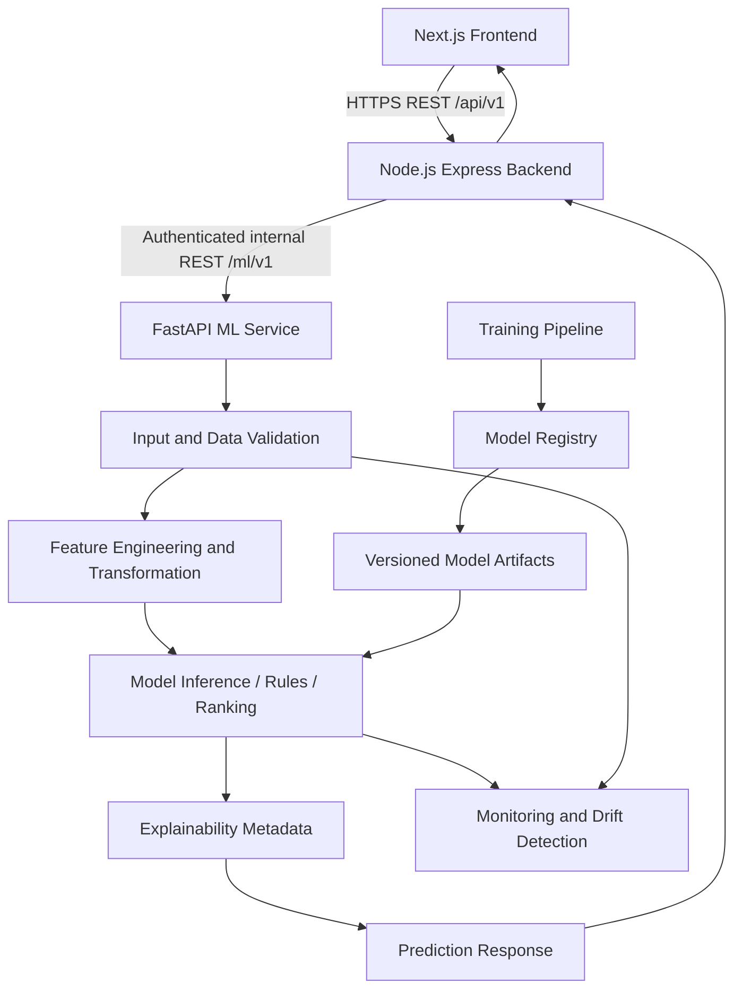

# EduCareer AI 360 ML Architecture

**Status:** Production-target architecture and governance design. The current `ml-service` remains a foundation scaffold; no production model, training pipeline, dataset, registry, or monitoring system is implemented by this document.

This document is subordinate to `docs/API.md` for endpoint names and payload contracts, and to `docs/DATABASE.md` for database entities and relationships.

## 1. Purpose

Define the production ML architecture for EduCareer AI 360 while preserving the current FastAPI service as a safe scaffold. The architecture covers data preparation, model development, inference, explainability, security, monitoring, and controlled lifecycle management for student-support and placement workflows.

ML outputs are decision-support estimates, not guarantees. Academic, career, and placement decisions must retain appropriate human oversight.

## 2. ML System Goals

- Provide reproducible and auditable predictions and rankings.
- Translate academic, engagement, skill, career, and placement data into actionable guidance.
- Keep the frontend dependent only on the Node.js backend.
- Isolate model inference from transactional persistence and authorization.
- Support low-latency online inference and asynchronous work where appropriate.
- Protect student privacy and minimize data sent to the ML service.
- Detect data quality problems, drift, degraded performance, and unsafe outputs before they affect users.
- Allow individual capabilities to be separated into independently scalable inference modules later.

No performance targets are asserted here unless already defined by the PRD/API contract; they become acceptance criteria during implementation and evaluation.

## 3. ML Capabilities

The authoritative internal ML capabilities are:

| Capability               | Internal endpoint                 | Problem type                           |
| ------------------------ | --------------------------------- | -------------------------------------- |
| Performance Prediction   | `POST /ml/v1/performance/predict` | Regression/risk estimation             |
| Career Recommendation    | `POST /ml/v1/career/recommend`    | Candidate generation and ranking       |
| Skill Gap Analysis       | `POST /ml/v1/skill-gap/analyze`   | Rules, matching, and prioritization    |
| Placement Readiness      | `POST /ml/v1/readiness/predict`   | Classification and/or score prediction |
| Job Matching             | `POST /ml/v1/jobs/match`          | Eligibility, similarity, and ranking   |
| What-If Career Simulator | `POST /ml/v1/simulator/predict`   | Scenario-based inference               |

`GET /ml/v1/health` is a service liveness endpoint. Resume parsing is not an ML endpoint in the current API contract and is intentionally not reintroduced here.

## 4. High-Level ML Architecture



The Node.js backend remains the public orchestration boundary. It derives authorized student context, calls the appropriate ML endpoint, normalizes responses, persists approved results where applicable, and applies fallback/error policy. The ML service does not grant access to database records or decide user authorization.

## 5. Data Flow

The intended lifecycle is:

```mermaid
flowchart LR
    RAW[Raw Application Data] --> CHECK[Validation]
    CHECK --> CLEAN[Cleaning and Privacy Filtering]
    CLEAN --> FEAT[Feature Engineering]
    FEAT --> SPLIT[Train / Validation / Test Split]
    SPLIT --> TRAIN[Training]
    TRAIN --> EVAL[Evaluation and Approval]
    EVAL --> REG[Model Registry]
    REG --> DEPLOY[Controlled Deployment]
    DEPLOY --> INF[Inference]
    INF --> MON[Monitoring]
```



For online prediction, the backend supplies only the authorized, minimum-necessary feature context. The service validates the request, applies the exact feature transformation version associated with the model, performs inference or deterministic analysis, attaches future metadata such as model version when available, and returns a typed response.

## 6. ML Lifecycle

1. Define the business decision and target without leakage.
2. Establish data ownership, consent, privacy classification, and retention.
3. Validate source data and document missingness and coverage.
4. Build reproducible feature transformations.
5. Split data by time, student, or cohort as appropriate to prevent leakage.
6. Train baseline and candidate approaches.
7. Evaluate quality, calibration, fairness, robustness, and latency.
8. Obtain review and register the approved model/artifact.
9. Deploy behind a controlled release and compatibility check.
10. Monitor inputs, outputs, errors, latency, and realized outcomes.
11. Retrain only through a reviewed, reproducible process.
12. Retire or roll back versions with an audit trail.

## 7. Feature Engineering

Feature definitions must be versioned, reproducible, and computed consistently in training and inference. Avoid using future outcomes or post-decision information.

### Academic features

- GPA/CGPA and historical GPA.
- Subject and semester performance.
- Assessment performance and normalized assessment results.
- Course-credit context.

### Engagement features

- Attendance and attendance trends.
- Assessment participation and submission behavior where available.
- Learning activity only when the application collects and authorizes it.

### Skill features

- Student skill inventory and proficiency level.
- Skill assessment scores and verification state.
- Certifications where represented and validated by the application.

### Career features

- Explicit interests.
- Target career and career-skill alignment.
- Required career skills and importance weights from the career taxonomy.

### Placement features

- Readiness indicators.
- Resume analysis score when available through the application.
- Historical placement-related outcomes only after target definition, consent, and leakage review.

The current ML request schemas expose bounded aggregates such as GPA, assessment scores, skill lists/counts, and job requirements. The repository does not contain a training dataset or feature store.

### Data availability boundaries

1. **Required for future training:** approved historical examples paired with clearly defined outcomes, such as future academic results for performance prediction, validated career relevance/selection signals for recommendation, labeled skill-gap reviews, placement outcomes for readiness, and reviewed application or hiring relevance signals for job matching. These datasets must be assembled, consented, de-identified as appropriate, versioned, and leakage-reviewed before use.
2. **Currently available through the application design:** `Student`, `AcademicRecord`, `Attendance`, `Assessment`, `AssessmentResult`, `StudentSkill`, `SkillAssessment`, `Career`, `CareerSkill`, `Job`, `JobSkill`, `JobMatch`, `ResumeAnalysis`, and `PlacementReadiness` entities described in `docs/DATABASE.md`, plus the bounded request fields described in `docs/API.md`.
3. **Not yet available in the repository:** labeled historical training datasets, confirmed placement outcomes, recommendation feedback labels, validated skill-equivalence datasets, feature store, model registry, trained artifacts, and production monitoring history. Their future existence must not be assumed by training or product claims.

## 8. Model Strategy

Use the least complex approach that is accurate, explainable, maintainable, and appropriate for the available labels. Every capability should begin with a deterministic or statistical baseline before more complex candidates are considered.

Models must not be described as production-ready solely because a library is listed in `ml-service/requirements.txt`. Candidate approaches below are design options, not implemented components.

## 9. Model Selection

Model selection should consider:

- Task-appropriate offline metrics and confidence intervals.
- Temporal and cohort generalization.
- Calibration and error costs.
- Explainability and ability to support student-facing reasons.
- Fairness and subgroup performance.
- Inference latency, memory, and operational complexity.
- Reproducibility and rollback compatibility.

Baseline and ensemble models should be compared because a simple baseline establishes whether added complexity creates meaningful, generalizable benefit. No target metric values are asserted by this document.

## 10. Training Pipeline

A future reproducible pipeline should:

1. Snapshot an approved source-data version.
2. Validate schema, ranges, uniqueness, missingness, and label availability.
3. Remove or transform protected/private data according to policy.
4. Generate features using a pinned feature version.
5. Split data using a leakage-safe temporal/cohort strategy.
6. Train baseline and candidate models with recorded seeds and parameters.
7. Evaluate quality, calibration, fairness, robustness, and resource usage.
8. Produce an artifact, evaluation report, feature manifest, and lineage metadata.
9. Require review/approval before registry promotion.

There is no training pipeline or dataset in the current repository.

## 11. Evaluation Strategy

Evaluation must use held-out data and reflect the deployment decision. Report aggregate and relevant subgroup results; do not publish unsupported accuracy claims.

### Performance prediction

- MAE
- RMSE
- R²
- Calibration/coverage for prediction intervals where provided

Candidate regression models may include Linear Regression, Random Forest, Gradient Boosting, and XGBoost. The baseline may be a historical GPA or cohort mean, subject to leakage review.

### Classification

- Accuracy
- Precision
- Recall
- F1
- ROC-AUC where appropriate
- Calibration and confusion matrix

### Recommendation

- Precision@K
- Recall@K
- NDCG@K
- Recommendation coverage
- Diversity/novelty where product policy requires it

### Matching

- Precision@K
- Recall@K
- Ranking quality and eligibility correctness

### Skill gap

- Agreement with validated career-skill requirements.
- Precision and recall for missing-skill identification once labeled examples exist.
- Expert review of priority assignments and synonym handling.

## 12. Prediction Pipeline

1. Authenticate and authorize the backend caller.
2. Validate the request schema and bounds.
3. Resolve authorized application data in the backend; do not trust client context.
4. Apply the registered feature version and transformations.
5. Confirm that the requested model version is available and compatible.
6. Run deterministic rules, ranking, or model inference.
7. Generate safe explanation metadata where supported.
8. Validate output ranges, labels, and required fields.
9. Return a typed response to the backend.
10. Emit privacy-safe telemetry with correlation ID, latency, capability, and version metadata when available.

Current scaffold responses are schema-compliant placeholders/simple calculations and must not be treated as production predictions.

## 13. Confidence and Uncertainty

### Current state

- No production model is implemented.
- No production confidence calculation is implemented.
- Current ML responses do not return model identifiers or confidence scores.
- The current performance response contains a `prediction_interval` field, but its scaffold value is not a calibrated production uncertainty estimate.

### Reserved/future contract metadata

Future responses may include:

- `model_version`
- `feature_version`
- `confidence`
- `prediction_interval` or another uncertainty representation where appropriate
- `explanation` metadata

Confidence must be calibrated and its meaning documented per capability. Low-confidence or out-of-distribution results should be labeled for review rather than presented as certainty.

## 14. Model Versioning

Use stable, capability-specific identifiers such as:

- `performance-v1`
- `career-ranking-v1`
- `skill-gap-v1`
- `readiness-v1`
- `job-matching-v1`
- `career-simulator-v1`

A model version identifies the algorithm and behavior contract. A release record must also capture dataset version, feature version, evaluation metrics, training timestamp, code revision, artifact checksum/location, approval status, and compatibility constraints. Version changes must be backward-compatible at the endpoint boundary or introduced through an intentional API version change.

## 15. Model Registry

A future registry should store at least:

- Model name and version.
- Capability/task.
- Algorithm and framework metadata.
- Feature version and dataset version.
- Training timestamp and code revision.
- Evaluation metrics, calibration, and subgroup results.
- Artifact location and checksum.
- Runtime dependencies and input/output contract version.
- Status such as `DEVELOPMENT`, `CANDIDATE`, `APPROVED`, `DEPLOYED`, `RETIRED`, or `REJECTED`.
- Approval, rollback, and deprecation history.

No registry is implemented in this repository.

## 16. Feature Versioning

Feature transformations are first-class versioned assets. A feature version must identify source fields, normalization, imputation, encoding, taxonomy snapshot, missing-value behavior, and output schema. Training and inference must use compatible feature versions. Changing semantics requires a new version and reevaluation; silently changing a feature in place is prohibited.

## 17. Data Validation

Validate at ingestion, training, and inference boundaries:

- Required fields and types.
- Numeric bounds such as GPA 0–10, percentages 0–1 or scores 0–100 as defined by the endpoint.
- Non-negative counts and positive credits where applicable.
- UUID and taxonomy references.
- Duplicate, stale, impossible, or contradictory records.
- Missingness and unexpected category values.
- Skill normalization and career/job taxonomy compatibility.
- Training label availability and leakage indicators.
- Output ranges and valid response labels.

Validation failures must be observable, actionable, and prevented from silently entering training data.

## 18. Model Monitoring

Future monitoring should cover:

- Request and response counts by capability and model version.
- Latency percentiles, timeouts, and resource usage.
- Validation and prediction error rates.
- Missing-feature and fallback rates.
- Prediction distributions and score ranges.
- Recommendation and match distribution, coverage, and eligibility outcomes.
- Realized model performance when outcomes become available.
- Calibration, subgroup quality, and fairness indicators.
- Model version usage and rollback events.

Monitoring must avoid logging raw PII, full resumes, tokens, or conversation content.

## 19. Drift Detection

- **Data drift:** Input feature distributions change from the training/reference population.
- **Concept drift:** The relationship between features and the outcome changes, such as changing hiring criteria.
- **Prediction drift:** Output distributions change, even when input drift is not obvious.

Drift alerts require investigation, impact assessment, and an approved response. Retraining must not happen automatically without validation, review, and promotion approval.

## 20. Retraining Strategy

Retraining cadence must be driven by data availability, outcome latency, drift, and business change—not an arbitrary schedule. A future process should:

1. Open a retraining review with a reason and affected capability.
2. Freeze a new approved data snapshot.
3. Re-run validation and leakage checks.
4. Train and evaluate candidates against the current production model and baseline.
5. Review fairness, calibration, security, and operational impact.
6. Register and approve the candidate.
7. Canary or shadow deploy where appropriate.
8. Promote, monitor, or roll back with an audit record.

## 21. Explainability

Student-facing outputs must provide understandable, non-misleading reasons when technically and ethically appropriate:

- **Performance:** important contributing academic/engagement features and limitations.
- **Career recommendation:** skill, academic, interest, and career-requirement alignment.
- **Skill gap:** missing or partial skills responsible for the gap and their priority source.
- **Readiness:** factors affecting the score, with caveats around uncertainty.
- **Job matching:** matching skills, missing requirements, and eligibility reasons.

Explanations must not expose sensitive features, other students, model secrets, or unsupported causal claims. No specific explainability library is assumed to be installed.

## 22. What-If Simulation Architecture

The simulator is scenario-based inference, not a database mutation and not a guarantee. The backend resolves the current authorized `Student` profile, applies bounded hypothetical changes, and invokes compatible career/matching/readiness pipelines.

Supported scenario categories may include:

- Improving an academic score.
- Acquiring skills.
- Completing certifications.
- Improving assessment performance.

The response compares baseline and simulated outputs. The simulator must record the active model/feature versions in future metadata and flag scenarios outside supported bounds. It must not persist simulated skills, grades, readiness, recommendations, or roadmap changes.

## 23. Career Recommendation Architecture

Career recommendation combines the student profile, academic indicators, verified skills, interests, and `Career`/`CareerSkill` requirements.

A hybrid design is appropriate:

1. **Candidate generation:** filter by basic eligibility and retrieve careers using taxonomy/skill overlap or similarity.
2. **Ranking:** rank candidates using weighted skill alignment, academic context, interests, and validated outcome signals when available.
3. **Post-processing:** apply policy constraints, diversity/coverage rules if approved, and safe explanation generation.

A baseline may use weighted rule matching or content-based similarity. Collaborative or learned ranking requires sufficient, representative historical feedback and privacy review. Top recommendations must not be presented as guaranteed outcomes.

## 24. Job Matching Architecture

Job matching compares a `Student` profile with `Job` and `JobSkill` requirements.

1. Apply hard eligibility such as minimum GPA before or alongside ranking.
2. Generate candidates through exact skill overlap, taxonomy matching, or semantic retrieval.
3. Rank using verified skill alignment, proficiency, readiness/experience signals, and career alignment.
4. Return match score plus eligibility and explanation metadata.

The baseline is keyword/skill overlap. Candidate approaches may include vector similarity, nearest-neighbor retrieval, or learned ranking after labeled outcomes exist. Students below a job’s minimum GPA remain ineligible regardless of similarity.

## 25. Skill Gap Architecture

Skill gap analysis is initially deterministic and taxonomy-driven:

1. Resolve the target `Career` and required `CareerSkill` records.
2. Normalize the student’s verified skills and proficiency.
3. Compare available, partial, and missing skills.
4. Assign priority from career importance and approved rules.
5. Optionally use similarity/synonym mapping only when validated.
6. Return gaps with actionable, explainable reasons.

The exact-match set difference is the baseline. Semantic similarity may assist with aliases, but uncertain matches must remain gaps or be flagged for review. Priority labels must map to the API contract and approved product taxonomy.

## 26. Placement Readiness Architecture

Placement readiness may combine classification and score prediction, but the exact target variable and labels must be established before training. The team must define whether the target is an offer, placement event, interview progression, or another outcome; the observation window; censoring; and acceptable false-positive/false-negative costs.

Candidate features include GPA, verified skill count, assessment/interview performance, resume analysis score, internships, and other authorized indicators. Candidate models may include a transparent baseline, logistic regression, tree ensembles, or calibrated gradient boosting. Outputs may include a 0–100 score, `HIGH|MODERATE|ACTION_NEEDED` label, drivers, and future uncertainty metadata.

No readiness target, trained model, or production score is established in the repository.

## 27. Performance Prediction Architecture

Performance prediction is a regression problem for a defined future academic outcome. The target window and label must be specified before training to prevent leakage.

Candidate features include historical GPA, subject/semester performance, assessment performance, attendance, assignment participation, and course-credit context. Candidate models may include Linear Regression, Random Forest, Gradient Boosting, and XGBoost. Compare them with a historical-GPA/mean baseline because a complex model is justified only by validated improvement.

Evaluate with MAE, RMSE, and R², plus interval coverage if uncertainty is returned. Current request fields and scaffold response shape are documented in `docs/API.md`; they do not represent an implemented production predictor.

## 28. ML Service Security

```text
Frontend
   |
  HTTPS
   |
Backend authentication and authorization
   |
Authenticated internal ML request
   |
FastAPI ML service
```

The ML service must not be treated as publicly accessible. Required controls include network isolation, authenticated service-to-service requests, secret management outside source code, TLS where applicable, bounded payloads, timeouts, rate limits, dependency checks, and redacted logs.

**Current:** token verification logic exists in the scaffold.

**Required before production:** all protected ML endpoints must enforce authentication through FastAPI dependencies/middleware or an equivalent validated mechanism. The current scaffold visibly defines `verify_token` but does not visibly apply it to each protected endpoint. This document does not implement that correction.

Student data must be minimized and preferably represented by UUIDs or aggregates. Do not send names, emails, roll numbers, passwords, tokens, raw resumes, unrelated student records, or unnecessary conversation content to ML inference.

## 29. ML Service Integration with Backend

The backend is responsible for:

- Authenticating the user and checking RBAC/scope.
- Loading authorized data from PostgreSQL through the application boundary.
- Constructing the exact ML request contract from server-trusted data.
- Calling `/ml/v1` over the internal network with service authentication.
- Applying correlation IDs, timeouts, bounded retries, and circuit breaking.
- Normalizing ML responses into the public `/api/v1` contract.
- Persisting approved results where the domain requires it.
- Hiding internal model details and upstream credentials from the frontend.

The frontend must never call the ML service directly. The current scaffold’s endpoint names and request/response fields are authoritative in `docs/API.md`.

## 30. Failure Handling

The future service should return predictable, sanitized errors for:

- **Invalid input:** reject with validation error; do not infer from malformed data.
- **Missing features:** use an explicitly approved fallback, request more data, or return a reviewable unavailable result; never silently fabricate values.
- **Model unavailable/loading failure:** return a dependency/service-unavailable error and emit an alert.
- **Prediction failure:** return an upstream/model error with correlation ID only.
- **Timeout:** enforce a bounded timeout; backend may retry only safe/idempotent requests within a budget.
- **ML service unavailable:** backend returns a stable `503`/`502` contract or an explicitly labeled cached result.
- **Unsupported model version:** return a compatibility error and do not silently substitute an unknown version.

Fallbacks must be distinguishable from model predictions and must not be persisted as authoritative outcomes without policy approval.

## 31. Scalability

Keep the service modular so each capability can later move to an independent inference module/service:

```text
ml-service/
  performance/
  career/
  skill_gap/
  readiness/
  matching/
  simulator/
```

This is an architectural direction only; these directories are not created by this document. Future scaling may use stateless inference replicas, cached taxonomy/vector indexes, asynchronous workers for long-running tasks, separate training/inference resources, and capability-specific autoscaling. PostgreSQL remains behind the backend rather than directly exposed to ML callers.

## 32. Observability

Use structured, privacy-safe telemetry with a correlation/request ID. Record capability, endpoint, model/feature version when available, validation outcome, latency, status, fallback state, and resource metrics. Metrics should support dashboards and alerts for traffic, latency, errors, timeouts, drift, data quality, output distributions, and realized model quality.

Tracing may follow a request from frontend to backend to ML service without capturing sensitive payloads. Logs must be access-controlled, retained according to policy, and scrubbed of credentials and PII.

## 33. Development vs Production ML

### Current development state

- FastAPI scaffold in `ml-service/main.py`.
- Six required capability endpoints plus health endpoint.
- Endpoint placeholders/simple scaffold calculations, not validated production models.
- No training datasets in the repository.
- No trained model artifacts or `.pkl` files.
- No production model registry.
- No production monitoring or drift detection.
- No production confidence calculation.
- No model identifiers in current responses.
- Token verification logic exists but protected endpoint enforcement is not visibly applied.

### Target production state

- Approved and documented datasets with privacy/lineage controls.
- Reproducible training and leakage-safe evaluation.
- Versioned features and taxonomies.
- Versioned, evaluated, calibrated models.
- Registry promotion gates and rollback.
- Secure authenticated inference.
- Explainable, bounded responses.
- Monitoring, drift detection, and outcome feedback.
- Controlled retraining with human approval.

## 34. Current Implementation Status

| Capability                  | Current Status                                                              | Target                                                                                       |
| --------------------------- | --------------------------------------------------------------------------- | -------------------------------------------------------------------------------------------- |
| Performance Prediction      | Scaffold endpoint; no production model or calibrated interval               | Evaluated regression model with versioned features, uncertainty, monitoring, and explanation |
| Career Recommendation       | Scaffold endpoint; no production ranking pipeline                           | Hybrid candidate generation and ranking with offline ranking evaluation and explanations     |
| Skill Gap Analysis          | Scaffold endpoint; no validated taxonomy/ranking engine                     | Deterministic taxonomy baseline plus validated synonym/similarity handling                   |
| Placement Readiness         | Scaffold endpoint; no established target label or production model          | Defined outcome, calibrated classifier/score model, fairness review, and drivers             |
| Job Matching                | Scaffold endpoint; no production retrieval/ranking model                    | Eligibility-aware similarity and ranking with ranking evaluation                             |
| What-If Career Simulator    | Scaffold endpoint; static foundation response; no scenario model            | Version-aligned scenario inference with bounds, comparison, and uncertainty caveats          |
| Model identifiers           | Not implemented in responses                                                | Registered capability/model version metadata                                                 |
| Confidence scores           | Not implemented; current interval is not calibrated                         | Calibrated confidence/uncertainty appropriate to each task                                   |
| Model registry              | Not implemented                                                             | Approved registry with lineage, metrics, artifacts, and status                               |
| Feature registry/versioning | Not implemented                                                             | Versioned transformation definitions and compatibility checks                                |
| Monitoring                  | Not implemented                                                             | Operational, quality, privacy-safe telemetry and alerts                                      |
| Drift detection             | Not implemented                                                             | Data, concept, and prediction drift monitoring                                               |
| Training pipeline           | Not implemented; no repository dataset                                      | Reproducible, reviewed, leakage-safe pipeline                                                |
| Explainability              | Not implemented as ML metadata                                              | Capability-specific, student-safe explanation metadata                                       |
| Secure endpoint enforcement | Token verification logic exists; dependency enforcement not visibly applied | Mandatory authenticated internal access on protected endpoints                               |

## 35. Future ML Enhancements

Future work may include:

- Establishing approved, representative training labels and outcome definitions.
- Feature and model registries with lineage and reproducibility.
- Calibrated uncertainty and out-of-distribution detection.
- Human feedback loops for recommendations, gaps, and matches.
- Fairness analysis across approved, privacy-safe cohorts.
- Offline/online ranking evaluation and controlled experimentation.
- Batch feature computation and vector indexes for larger career/job catalogs.
- Capability-specific inference modules and autoscaling.
- Secure model artifact signing and supply-chain verification.
- Privacy-preserving analytics and stronger retention/deletion workflows.
- Shadow, canary, and rollback deployment strategies.

These enhancements require product, data-governance, security, and ML review before implementation.
