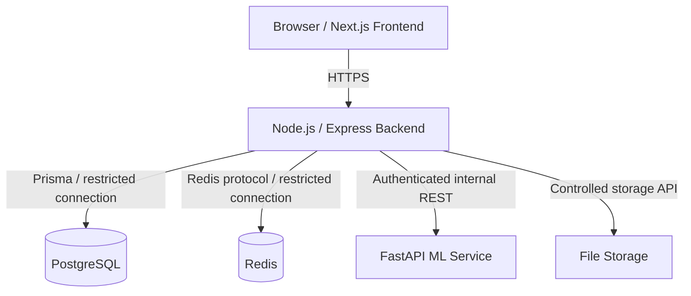

# EduCareer AI 360 Security Architecture

**Status:** Security architecture and control requirements only. This document does not claim that the target controls are implemented.

`docs/API.md` is authoritative for public API behavior and roles. `docs/DATABASE.md` is authoritative for entities and relationships. `docs/ML_ARCHITECTURE.md` is authoritative for ML-service boundaries and ML security. `docs/ARCHITECTURE.md` is authoritative for system boundaries.

## 1. Security Objectives

- Protect student, faculty, TPO, administrator, academic, placement, resume, and conversation data.
- Enforce authenticated, authorized access at the backend boundary.
- Preserve confidentiality, integrity, availability, accountability, and privacy.
- Prevent unauthorized role escalation and cross-student access.
- Keep the ML service, database, cache, and file storage behind controlled service boundaries.
- Make security failures observable without logging secrets or unnecessary personal data.

## 2. Security Principles

- Least privilege and default deny.
- Defense in depth.
- Server-side enforcement; frontend controls are not security controls.
- Explicit trust boundaries and authenticated service-to-service communication.
- Secure defaults and fail-closed behavior.
- Minimize collection, transmission, retention, and exposure of personal data.
- Validate at every boundary and treat all client input as untrusted.
- Reproducibility, traceability, and human review for sensitive or ML-assisted decisions.
- Separate current scaffold status from target production controls.

## 3. System Trust Boundaries



- **Public boundary:** Browser-to-backend traffic. Requests, headers, files, and tokens crossing this boundary are untrusted until validated.
- **Authenticated application boundary:** The Node.js backend after authentication and request validation. It is the primary application security boundary and owns RBAC, ownership checks, persistence orchestration, and public API responses.
- **Internal service boundary:** Backend-to-ML traffic over an internal network with service authentication. The ML service must not be a public client dependency.
- **Database boundary:** PostgreSQL is reachable only through controlled backend/database credentials. The frontend never accesses PostgreSQL directly.
- **ML service boundary:** FastAPI accepts only approved internal backend requests in production; it does not perform user authorization or directly expose database records.
- **File storage boundary:** Resume and future document storage is private and accessed through backend authorization and short-lived signed retrieval where appropriate.
- **Cache/queue boundary:** Redis is an internal dependency; it must not be exposed publicly or treated as a durable source of truth.

## 4. Authentication

The exact authentication flow is not finalized. Possible mechanisms include email/password, institutional SSO, and OAuth/OIDC. The selected mechanism must be documented and threat-modeled before implementation.

**Current:** Email/password authentication foundation is implemented with short-lived JWT access tokens, revocable hashed refresh sessions, email verification, password reset, and server-side role resolution. SSO/OIDC remains a future phase.

**Target:** A formally selected mechanism with secure identity proofing, token/session handling, account recovery, abuse protection, audit events, and role assignment controls. Authentication failures must return generic responses that do not disclose account existence.

## 5. Authorization

Authorization is enforced by the backend after authentication and before resource access or mutation. Checks must cover role, ownership, institution/department scope, resource state, and action. A resource outside the caller’s scope may return `404` to reduce disclosure, as defined by `API.md`.

## 6. Role-Based Access Control

RBAC uses the four roles defined by `API.md`: `STUDENT`, `FACULTY`, `TPO`, and `ADMIN`. Permissions should be centralized, allowlisted, auditable, and evaluated server-side. Role names and permissions must not be accepted from untrusted client claims without validating them against current server state.

## 7. User Roles

| Role    | Responsibilities and boundary                                                                                                                                                                    |
| ------- | ------------------------------------------------------------------------------------------------------------------------------------------------------------------------------------------------ |
| STUDENT | Manage and view own profile, academics where permitted, skills, resumes, recommendations, gaps, roadmaps, applications, coach conversations, and notifications. No institutional administration. |
| FACULTY | View assigned student/cohort academic information, manage permitted academic records, validate skills, and view assigned analytics. No global role or system administration.                     |
| TPO     | Manage placement-scoped companies/jobs, review applications, access candidate/readiness data, matching, and placement reports. No global identity administration unless separately granted.      |
| ADMIN   | System-wide user/role provisioning, configuration, audit access, and administrative operations. Access should still be logged and limited to need.                                               |

### Permissions matrix

`Own` means the authenticated student’s own resource. `Scoped` means the faculty member’s assigned department/course or the TPO’s institutional placement scope. `Read` and `Write` remain subject to endpoint-level validation and state rules in `API.md`.

| Resource category      | STUDENT                          | FACULTY                                 | TPO                             | ADMIN                                            |
| ---------------------- | -------------------------------- | --------------------------------------- | ------------------------------- | ------------------------------------------------ |
| Profile                | Read/write own                   | Read assigned                           | Read placement scope            | Read/manage system scope                         |
| Academics              | Read own                         | Read/write assigned                     | Read authorized aggregates      | Read/write system scope                          |
| Attendance             | Read own                         | Read/write assigned                     | Read authorized aggregates      | Read/write system scope                          |
| Assessments            | Read own results                 | Read/write assigned assessments/results | Read authorized placement data  | Read/write system scope                          |
| Skills                 | Read/write own inventory         | Read assigned; validate                 | Read authorized candidates      | Read/manage taxonomy and scope                   |
| Career recommendations | Read/request own                 | Read/request for advisees               | Read authorized placement scope | Read/request system scope                        |
| Skill gaps             | Read/request own                 | Read/request for advisees               | Read authorized scope           | Read/request system scope                        |
| Placement readiness    | Read own                         | Read only if policy grants scope        | Read/request placement scope    | Read/request system scope                        |
| Resumes and analyses   | Own upload/read/delete/analyze   | No default access                       | Read authorized placement scope | Read authorized system scope                     |
| Companies              | No access by default             | No access by default                    | Read/write placement scope      | Read/write system scope                          |
| Jobs                   | Read/apply                       | Read where authorized                   | Read/write placement scope      | Read/write system scope                          |
| Applications           | Read/write own permitted actions | No default access                       | Read/review placement scope     | Read/review system scope                         |
| Reports                | Read own/authorized              | Read assigned academic scope            | Read/generate placement reports | Read/generate system reports                     |
| Faculty functions      | No access                        | Own/assigned faculty functions          | No access by default            | Manage where required                            |
| TPO functions          | No access                        | No access by default                    | Own/placement functions         | Manage where required                            |
| Administration         | No access                        | No access                               | No access by default            | Read/write administrative functions              |
| Audit logs             | No access                        | No access                               | No access                       | Read; append through audited system actions only |

This matrix is a high-level policy summary; a concrete permission catalog must not grant broader access than the endpoint contracts in `API.md`.

## 8. JWT Strategy

JWT is a recommended option, not a finalized implementation. If selected, use a vetted asymmetric signing strategy where operationally appropriate, explicit issuer/audience, key IDs, key rotation, algorithm allowlisting, short access-token lifetime, and strict validation of signature, expiry, not-before, issuer, audience, and role claims.

Do not accept `alg=none`, algorithm confusion, unsigned tokens, arbitrary role claims, or tokens issued for another service. Key material must be managed outside source control.

## 9. Access Tokens

Access tokens should be short-lived and contain only the minimum identity/authorization claims required by the backend, such as user ID and active role. Exact expiration is not finalized; `API.md` gives a target of 15 minutes, not a completed implementation. Store browser access tokens in the least exposed appropriate mechanism, preferably memory rather than persistent browser storage, and never log them.

## 10. Refresh Tokens

Refresh-token flow is an open architectural decision. If used, refresh tokens should be opaque or securely signed, stored in a `Secure`, `HttpOnly`, appropriately `SameSite` cookie, scoped to the refresh path, rotated on use, and invalidated on logout, suspected compromise, account suspension, or role-security events. Store only a protected representation server-side when stateful revocation is required.

Implement reuse detection, family invalidation, bounded lifetime, concurrent-use policy, and generic failure responses. The exact seven-day target in `API.md` is not finalized as implementation behavior.

## 11. Password Security

If email/password is selected:

- Never store plaintext or reversibly encrypted passwords.
- Use a modern adaptive password hash such as Argon2id or an equivalently approved algorithm, with parameters reviewed for the deployment environment.
- Enforce a product-approved strength policy and reject known compromised passwords where feasible.
- Compare hashes using the library’s constant-time verification.
- Rate-limit and monitor failed authentication.
- Protect against credential stuffing with breached-password checks, progressive throttling, and optional MFA for high-risk roles.
- Do not reveal whether an email exists.

No password hashing implementation is currently finalized or proven in the repository.

## 12. Password Reset

**OPEN DECISION:** The password-reset flow is unspecified.

Any future flow must use a single-use, high-entropy reset token with short expiration, secure delivery, invalidation after use or password change, generic account-existence responses, rate limiting, audit events, and no password disclosure. Reset tokens must not appear in logs, analytics, referrers, or URLs where avoidable.

## 13. SSO / OAuth

**OPEN DECISION:** The SSO/OAuth flow is unspecified. Institutional SSO and OAuth/OIDC are possible options. If implemented, prefer standards-based OAuth 2.0/OpenID Connect with a vetted provider, authorization-code flow with PKCE where applicable, strict redirect allowlists, state/nonce validation, issuer/audience validation, claim-to-role mapping, account-linking policy, and logout/session policy. Do not treat arbitrary provider claims as trusted roles.

## 14. Session Security

Sessions must have bounded lifetime, inactivity/absolute expiry policy, logout invalidation, role-change invalidation, and protection against fixation and replay. Cookies, if used, require `Secure`, `HttpOnly`, and appropriate `SameSite` settings. Avoid storing sensitive tokens in local storage. Support session/device visibility and revocation where required by the selected mechanism.

## 15. API Security

All public endpoints use `/api/v1` and the conventions in `API.md`. Required controls include HTTPS, authentication for protected endpoints, server-side authorization, strict request/response validation, pagination and payload limits, rate limiting, request IDs, safe errors, audit logging for security-relevant mutations, and dependency timeouts. Do not expose internal database, Redis, ML, or storage endpoints through the public API.

## 16. ML Service Security

```text
Frontend
   ↓ HTTPS
Backend authentication and authorization
   ↓ backend-authorized internal request
FastAPI ML service
```

The ML service must not be publicly exposed in production. The backend must derive and minimize inputs, authenticate the service request, apply timeouts and bounded retries, and normalize the response. The ML service must not decide user access or directly query application data.

**Current:** Token verification logic exists in the scaffold.

**Required before production:** Protected ML endpoints must actually enforce authentication/authorization through FastAPI dependencies, middleware, or an equivalent validated mechanism. `main.py` currently defines `verify_token`, but endpoint dependency enforcement is not visibly applied. No implementation is performed here.

## 17. Input Validation

Never rely on frontend validation. Validate at the backend and ML boundaries:

- JSON content type, body shape, required fields, and unknown fields.
- UUID path parameters and referenced resource existence/scope.
- Query parameters, pagination bounds, allowlisted sorting, and filters.
- Strings for length, encoding, normalization, and prohibited control content.
- Enums such as roles, statuses, priorities, proficiency levels, and formats.
- Dates for parseability, timezone, ordering, and allowed future/past windows.
- Numeric ranges such as GPA 0–10, percentage 0–1, score 0–100, and non-negative counts.
- Cross-field constraints, duplicate records, state transitions, and authorization context.
- ML outputs before returning or persisting them.

## 18. Data Protection

Classify data by sensitivity and apply least-privilege access, encryption in transit, encryption at rest where supported, restricted service accounts, retention limits, and auditability. Separate academic records, placement records, resumes, AI conversations, notifications, and audit data according to `DATABASE.md` relationships and access policy.

## 19. Sensitive Data Handling

Treat student identifiers, names, emails, roll numbers, academic records, attendance, assessments, resumes, skill assessments, placement data, conversations, tokens, secrets, and audit payloads as sensitive. Minimize fields by purpose, redact logs, avoid unnecessary copies, restrict exports, and prevent sensitive data in URLs. ML requests should use UUIDs and minimum-necessary aggregates rather than raw PII.

## 20. File Upload Security

The API contract defines resume uploads as PDF with a maximum of 5 MiB and roster CSV uploads as a maximum of 20 MiB. Future implementation must:

- Validate declared MIME type, file signature/magic bytes, extension, size, and content structure.
- Sanitize and ignore client filenames when generating storage keys.
- Scan uploads for malware where required before permanent staging.
- Store files outside executable/public web roots with private access.
- Use generated UUID/hash keys and authorization checks on every retrieval.
- Prevent path traversal, archive bombs, active content, and direct executable access.
- Issue short-lived signed URLs only after backend authorization.
- Record upload, scan, access, failure, and deletion events without logging contents.

## 21. Database Security

- Use least-privilege PostgreSQL credentials and separate application/migration identities where feasible.
- Restrict database network access to approved services.
- Use Prisma/parameterized queries and review any raw SQL.
- Encrypt database connections in production where supported.
- Protect backups and replicas with equivalent access controls and encryption.
- Require controlled, reviewed migrations; never run schema changes from untrusted requests.
- Protect sensitive fields and avoid returning password hashes or internal identifiers unnecessarily.
- Apply transaction and timeout limits to reduce abuse.

No Prisma schema changes are part of this document.

## 22. Secrets Management

Real secrets must never be committed, copied into documentation, or hardcoded. Production secrets should come from a managed environment/secret manager with access controls, rotation, auditability, and separate values per environment. This includes database credentials, JWT keys, ML service tokens, storage credentials, and external API keys.

## 23. Environment Variables

Local `.env` files must remain ignored. `.env.example` files may contain names and placeholders only, never real secrets. The repository currently contains local environment files and a root ignore rule for `.env`/`.env.*` with an exception for `.env.example`; tracked status must be checked before release. Do not print, rewrite, rotate, or expose existing secret values as part of documentation work.

## 24. Rate Limiting

Apply layered per-IP, per-account, and per-service quotas. Sensitive or expensive operations require stricter limits:

- Login and credential verification: target 5 attempts/minute/IP from `API.md`.
- Password reset: strict attempts and delivery quotas.
- Token refresh: replay and abuse limits.
- AI Coach and ML predictions: user/service quotas and concurrency limits.
- Resume/file uploads: target 10 requests/minute/IP for resume ingestion.
- Expensive reports and exports: queue/concurrency limits.

Return `429 RATE_LIMITED` with safe retry guidance. Exact production limits require load and threat testing.

## 25. CORS

Use an explicit production allowlist of trusted frontend origins configured outside source code. Do not use unrestricted `*` for authenticated APIs or combine wildcard origins with credentials. Validate allowed methods/headers, keep preflight behavior intentional, and separate local development origins from production.

## 26. CSRF

CSRF requirements depend on the final authentication strategy. Cookie-authenticated state-changing requests require CSRF defenses such as SameSite policy plus a robust synchronizer or double-submit token, origin checks, and safe method handling. Bearer tokens not automatically sent by browsers reduce CSRF exposure but do not remove XSS/token-theft risks. Do not claim a final mechanism before authentication is selected.

## 27. XSS

- Rely on framework output encoding for ordinary text.
- Sanitize user-generated content before any intentional rich rendering.
- Avoid unsafe HTML injection, dangerous URL schemes, and inline script creation.
- Treat resume text, AI responses, job descriptions, messages, and report content as untrusted.
- Deploy a restrictive Content Security Policy when compatible with the frontend.
- Use security headers and test DOM/reflected/stored XSS paths.

## 28. SQL Injection

Use Prisma and parameterized queries. Never concatenate user input into SQL, identifiers, filters, ordering, or raw query fragments. Any unavoidable raw SQL must use safe parameter binding, allowlists, code review, least-privilege credentials, and tests for injection attempts.

## 29. Command Injection

Do not pass request fields to shell commands. Prefer library APIs. If an unavoidable process is introduced later, use fixed executable paths, argument arrays rather than shell strings, strict allowlists, resource/time limits, isolated identities, and sanitized environment variables.

## 30. SSRF

For future external URLs, document/file resources, or callbacks:

- Allow only approved schemes such as HTTPS where required.
- Validate hostnames and resolve/recheck DNS safely.
- Block loopback, link-local, private, metadata-service, and internal network targets unless explicitly approved.
- Validate every redirect and limit redirect count.
- Restrict egress at the network layer.
- Apply timeouts, response-size limits, content-type checks, and isolated fetch workers.

## 31. Authentication Abuse

Protect login and identity flows against brute force, credential stuffing, enumeration, replay, session fixation, refresh-token reuse, and automated account discovery. Use progressive throttling, generic messages, anomaly signals, optional MFA for privileged roles, and security notifications where appropriate. Never log credentials or tokens.

## 32. Authorization Abuse

Prevent IDOR/BOLA by checking ownership and scope on every path parameter, body identifier, query filter, file, conversation, report, and application. Use default deny, centralized policy checks, server-derived identity, immutable audit events for role/permission changes, and tests for every role/resource combination. Frontend-hidden buttons are not authorization.

## 33. Logging and Auditing

Log security-relevant events with timestamp, actor UUID where known, action, resource/record, request ID, outcome, and safe metadata:

- Login success/failure.
- Logout, refresh failure, and token reuse detection.
- Password reset requests/completions.
- Role and permission changes.
- Sensitive profile, academic, placement, or application changes.
- Report generation/export and administrative actions.
- ML service authentication failures and suspicious requests.

Never log passwords, access/refresh tokens, secrets, authorization headers, raw resumes, unnecessary PII, or full conversation content. Protect logs from tampering and restrict access.

## 34. Security Monitoring

Future monitoring should alert on unusual 401/403 spikes, brute-force patterns, role changes, cross-scope access failures, upload scan failures, SSRF blocks, rate-limit violations, ML authentication failures, dependency outages, data exports, and abnormal service behavior. Metrics and traces must use correlation IDs and privacy-safe dimensions. Monitoring itself requires access control, retention, and redaction.

## 35. Error Handling

Return the standardized `API.md` error envelope with stable codes such as `UNAUTHENTICATED`, `FORBIDDEN`, `NOT_FOUND`, `VALIDATION_ERROR`, `RATE_LIMITED`, `UPSTREAM_ERROR`, and `INTERNAL_ERROR`. Use generic production messages, avoid account/resource enumeration, and never return stack traces, SQL, paths, secrets, tokens, prompts, or model internals. Include a request ID for support without exposing diagnostic data.

## 36. Security Headers

The backend currently uses Helmet in `app.ts`; production policy should verify and configure the required headers, including an appropriate Content Security Policy, `X-Content-Type-Options`, clickjacking protection, strict referrer policy, and HSTS only when HTTPS deployment is guaranteed. Header policy must be tested against frontend requirements rather than blindly weakened.

## 37. Transport Security

Use HTTPS for browser-to-backend traffic and protect internal service traffic according to deployment risk, using TLS/mTLS where appropriate. Disable obsolete protocols and weak ciphers, protect certificates and private keys, redirect or reject plaintext production requests, and configure secure cookies only over HTTPS. Development HTTP behavior must not be copied to production.

## 38. Privacy Considerations

Apply data minimization, purpose limitation, access control, retention limits, deletion, export, transparency, and consent where applicable. Do not make legal compliance claims without a confirmed jurisdictional and institutional assessment. Students should be informed when AI-assisted scores, recommendations, matching, or readiness indicators are used and that outputs are estimates requiring appropriate human judgment.

## 39. Data Retention

Define retention by data class and purpose before implementation. Include active records, resumes, analyses, AI conversations/messages, notifications, reports, audit logs, backups, temporary uploads, ML telemetry, and failed jobs. Deletion must account for authorized requests, legal/institutional holds where applicable, derived copies, caches, signed URLs, and backup expiry. Do not retain raw data indefinitely for possible future training.

## 40. Backup and Recovery Security

Protect backups with encryption, separate credentials, least privilege, access logging, retention policy, and isolation from production compromise. Test restoration and recovery procedures periodically, including integrity checks and access revocation. Define RPO/RTO with stakeholders; exact backup schedules and infrastructure are not established by the current repository.

## 41. Dependency Security

Maintain lockfiles and review dependency advisories, transitive risk, licenses, provenance, and update impact. Use automated scanning in CI when the project adopts it, pin or constrain trusted versions, remove unused packages, and review security-sensitive upgrades. No dependency changes are made by this document.

## 42. Container Security

Future production containers should use minimal pinned base images, non-root users, read-only filesystems where feasible, dropped Linux capabilities, resource limits, network restrictions, vulnerability scanning, secret injection rather than image-baked secrets, and signed/provenance-checked images. Do not expose PostgreSQL, Redis, or ML service ports publicly unless explicitly required and protected.

## 43. ML Security

Protect training data, feature transformations, model artifacts, registry metadata, and inference inputs/outputs. Consider data/model poisoning, manipulated academic or skill inputs, adversarial text, model extraction, prediction abuse, sensitive feature leakage, membership inference, and model-version tampering. Use lineage, artifact checksums/signing, access control, input bounds, output monitoring, rate limits, privacy filtering, and human review. The detailed ML lifecycle remains in `docs/ML_ARCHITECTURE.md`.

## 44. Threat Model

| Threat                              | Attack surface                               | Potential impact                                   | Mitigation                                                                   | Priority    |
| ----------------------------------- | -------------------------------------------- | -------------------------------------------------- | ---------------------------------------------------------------------------- | ----------- |
| Credential theft                    | Login, browser, refresh session              | Account takeover and data exposure                 | Secure token/session design, HTTPS, rotation, MFA decision, abuse monitoring | High        |
| Brute force                         | Login/reset/refresh                          | Account compromise or service exhaustion           | Rate limits, throttling, generic errors, anomaly detection                   | High        |
| Privilege escalation                | Role claims, admin APIs                      | Unauthorized institutional/system access           | Server-side RBAC, default deny, audited role changes                         | Critical    |
| IDOR/resource authorization failure | UUID paths, filters, downloads               | Cross-student academic/resume/application exposure | Ownership and scope checks on every request                                  | Critical    |
| Malicious file upload               | Resume/roster multipart endpoints            | Malware, parser compromise, storage abuse          | Size/type/signature validation, scanning, isolation, generated keys          | High        |
| XSS                                 | Job text, AI output, profile/message content | Session theft or user compromise                   | Encoding, sanitization, CSP, safe rendering                                  | High        |
| CSRF                                | Cookie-authenticated mutations               | Unauthorized changes                               | Final-strategy-dependent CSRF/origin/SameSite controls                       | High        |
| SQL injection                       | Filters, sorting, raw queries                | Database disclosure/modification                   | Prisma/parameterization, allowlists, review                                  | Critical    |
| SSRF                                | Future URL/resource fetches                  | Internal service or metadata access                | Scheme/host validation, redirect checks, egress restrictions                 | High        |
| API abuse                           | Public API, reports, coach, ML               | Cost, availability, data scraping                  | Auth, quotas, pagination, payload/concurrency limits                         | High        |
| ML service unauthorized access      | ML network/API                               | Prediction abuse or data exposure                  | Private network and enforced service authentication                          | Critical    |
| Secret leakage                      | Env files, logs, images, CI                  | Database/service takeover                          | Ignore local env, secret manager, redaction, rotation                        | Critical    |
| Data exposure                       | DB, exports, backups, logs                   | Privacy and institutional harm                     | Encryption, least privilege, minimization, retention                         | Critical    |
| Model abuse                         | Prediction/simulation inputs                 | Misleading decisions, extraction, manipulation     | Bounds, monitoring, rate limits, uncertainty and human review                | Medium/High |
| Insecure dependencies               | Node/Python packages/images                  | Supply-chain compromise                            | Lockfiles, scanning, review, pinned images                                   | High        |

## 45. Security Testing

Before production, establish:

- Unit tests for validation, policy, token/session handling, redaction, and state transitions.
- Integration tests for API authentication, authorization, ownership, uploads, database access, and ML service calls.
- Negative tests for every role/resource combination, IDOR, enumeration, malformed input, and rate limits.
- Dependency and container vulnerability scanning.
- Static analysis and secret scanning.
- File-upload, XSS, CSRF, SSRF, SQL-injection, command-injection, and abuse-case tests.
- ML input manipulation, artifact integrity, privacy, and output-safety tests.
- Penetration testing and remediation review before production.

No tools or dependencies are added by this document.

## 46. Incident Response

Define an incident process covering detection, triage, containment, eradication, recovery, evidence preservation, communications, and post-incident review. Prepare playbooks for account takeover, secret leakage, role escalation, data exposure, malicious uploads, ML compromise, and dependency vulnerabilities. Maintain contact ownership, severity criteria, credential/session revocation steps, backup recovery procedures, and audit trails.

## 47. Development vs Production Security

### Current development state

- `app.ts` uses Helmet, configured CORS, and JSON parsing; this is not a complete production security posture.
- Authentication and authorization are not implemented/finalized.
- JWT and refresh-token behavior are not implemented.
- Password reset and SSO/OAuth are open decisions.
- RBAC middleware is not implemented.
- Rate limiting is not implemented.
- ML token verification logic exists, but protected endpoint enforcement is not visibly applied.
- Environment files exist locally and are ignored; no real values are reproduced here.
- Database, file-storage, backup, monitoring, and incident controls are not proven as production implementations.

### Target production security

- Selected and reviewed authentication mechanism.
- Secure access/refresh session lifecycle and account recovery.
- Centralized RBAC and resource-level authorization.
- Validated inputs, safe outputs, rate limits, CORS/CSRF/XSS controls, and secure headers.
- Private authenticated ML service with least-privilege service identity.
- Secure upload, storage, database, secrets, backups, containers, and dependencies.
- Security telemetry, immutable audit events, testing gates, incident response, and periodic review.

## 48. Current Security Status

| Security Area        | Current Status                                            | Target Status                                        |
| -------------------- | --------------------------------------------------------- | ---------------------------------------------------- |
| Authentication       | Implemented for v1 email/password; SSO remains open       | Formally selected and securely implemented           |
| Authorization        | Not Implemented                                           | Server-side resource and scope authorization         |
| JWT                  | Implemented; short-lived signed access tokens             | Validated, signed, rotated-key token strategy        |
| Refresh Tokens       | Implemented; hashed, expiring, revocable, non-rotating    | Rotated, revocable, reuse-detecting lifecycle        |
| Password Reset       | Implemented; delivery integration remains pending         | Single-use, expiring, rate-limited recovery          |
| SSO                  | Open Decision                                             | Reviewed OAuth/OIDC or institutional SSO integration |
| RBAC                 | Role guard foundation implemented; business scope partial | Default-deny centralized RBAC and audit              |
| Input Validation     | Partially Implemented                                     | Complete schema validation at all boundaries         |
| Rate Limiting        | Not Implemented                                           | Layered IP/account/service quotas                    |
| CORS                 | Partially Implemented                                     | Explicit environment-specific production allowlist   |
| ML Authentication    | Scaffolded; enforcement not visibly applied               | Mandatory protected-endpoint enforcement             |
| Secrets Management   | Partially Defined                                         | Managed secret delivery, rotation, and auditing      |
| Audit Logging        | Schema/documentation exists; implementation not proven    | Complete tamper-resistant security audit trail       |
| Security Monitoring  | Not Implemented                                           | Alerts, dashboards, and privacy-safe telemetry       |
| File Upload Security | Documented; not implemented                               | Validated, scanned, isolated, authorized storage     |
| Dependency Security  | Dependencies exist; security process not proven           | Scanning, review, lockfile/image governance          |

## 49. Future Security Enhancements

Future work may include:

- Final authentication, refresh, password-reset, and SSO decisions.
- MFA and step-up authentication for privileged or high-risk operations.
- Centralized policy enforcement and automated authorization test matrices.
- Managed secrets, key rotation, artifact signing, and supply-chain controls.
- Secure upload scanning and private object-storage integration.
- Security information/event monitoring and anomaly detection.
- Privacy-preserving exports, deletion workflows, and retention automation.
- ML endpoint enforcement, model integrity checks, abuse monitoring, and fairness/privacy review.
- Threat-led penetration testing, disaster-recovery exercises, and incident simulations.

## Open Decisions

The following decisions remain intentionally unresolved:

1. Exact refresh-token flow.
2. Password-reset flow.
3. SSO/OAuth flow.
4. Exact report types.
5. Report export formats beyond CSV/PDF.
6. Faculty access policy for placement-readiness data.
7. Production ML model identifiers.
8. Confidence-score semantics.
